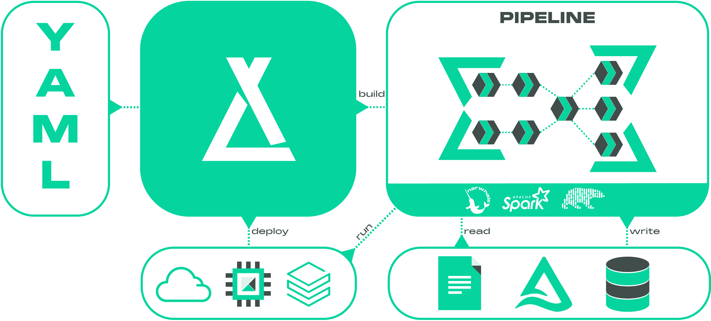
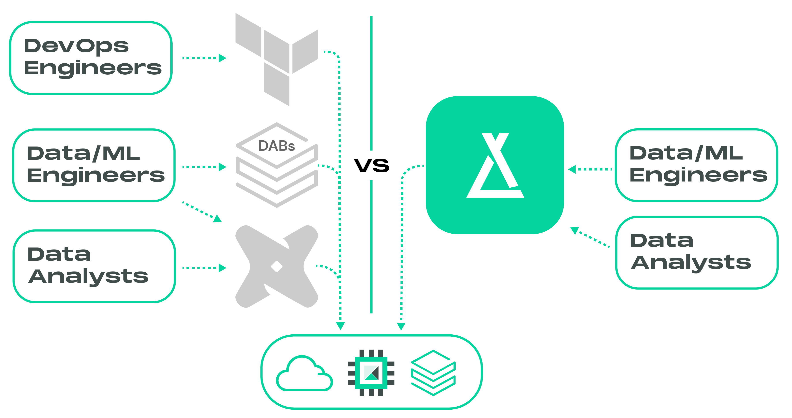

# Laktory

[](https://pypi.org/project/laktory/)
[](https://github.com/okube-ai/laktory/actions/workflows/test.yml)
[](https://pepy.tech/project/laktory)
[](https://github.com/okube-ai/laktory)
[](https://github.com/okube-ai/laktory/blob/main/LICENSE)

An open-source DataOps and dataframe-centric ETL framework for building 
lakehouses.


Laktory is your all-in-one solution for defining both data transformations and 
Databricks resources. Imagine if Terraform, Databricks Asset Bundles, and dbt
combined forces—that's essentially Laktory.

This open-source framework simplifies the creation, deployment, and execution 
of data pipelines while adhering to essential DevOps practices like version 
control, code reviews, and CI/CD integration. With Apache Spark and Polars
driving its data transformation, Laktory ensures reliable and scalable data
processing. Its modular, flexible approach allows you to seamlessly combine SQL
statements with DataFrame operations.



Since Laktory pipelines are built on top of Spark and Polars, they can run in
any environment that supports Python—from your local machine to a Kubernetes 
cluster. They can also be deployed and orchestrated as Databricks Jobs or
[Declarative Pipelines](https://www.databricks.com/product/data-engineering/lakeflow-declarative-pipelines),
offering a simple, fully managed, and low-maintenance solution.

But Laktory goes beyond data pipelines. It empowers you to define and deploy 
your entire Databricks data platform—from Unity Catalog and access grants
to compute and quality monitoring—providing a complete, modern solution
for data platform management. This empowers your data team to take full 
ownership of the solution, eliminating the need to juggle multiple technologies.
Say goodbye to relying on external Terraform experts to handle compute, workspace
configuration, and Unity Catalog, while your data engineers and analysts try 
to combine Databricks Asset Bundles and dbt to build data pipelines. Laktory
consolidates these functions, simplifying the entire process and reducing
the overall cost.




## Help
See [documentation](https://www.laktory.ai/) for more details.

## Installation
Install using 
```commandline
pip install laktory
```

For more installation options,
see the [Install](https://www.laktory.ai/install/) section in the documentation.

## A Basic Example
```py
from laktory import models


node_brz = models.PipelineNode(
    name="brz_stock_prices",
    source={
        "format": "PARQUET",
        "path": "./data/brz_stock_prices/"
    },
    transformer={
        "nodes": []
    }
)

node_slv = models.PipelineNode(
    name="slv_stock_prices",
    source={
        "node_name": "brz_stock_prices"
    },
    sinks=[{
        "path": "./data/slv_stock_prices",
        "mode": "OVERWRITE",
        "format": "PARQUET",
    }],
    transformer={
        "nodes": [
            
            # SQL Transformation
            {
                "expr": """
                    SELECT
                      data.created_at AS created_at,
                      data.symbol AS symbol,
                      data.open AS open,
                      data.close AS close,
                      data.high AS high,
                      data.low AS low,
                      data.volume AS volume
                    FROM
                      {df}
                """   
            },
            
            # Spark Transformation
            {
                "func_name": "drop_duplicates",
                "func_kwargs": {
                    "subset": ["created_at", "symbol"]
                }
            },
        ]
    }
)

pipeline = models.Pipeline(
    name="stock_prices",
    nodes=[node_brz, node_slv],
)

pipeline.execute(spark=spark)
```

To get started with a more useful example, jump into the [Quickstart](https://www.laktory.ai/quickstart/).

## Get Involved
Laktory is growing rapidly, and we'd love for you to be part of our journey! Here's how 
you can get involved:
- **Join the Community**: Connect with fellow Laktory users and contributors on our [Slack](http://okube.slack.com/). Share ideas, ask questions, and collaborate!
- **Suggest Features or Report Issues**: Have an idea for a new feature or encountering an issue? Let us know on [GitHub Issues](https://github.com/okube-ai/laktory/issues). Your feedback helps shape the future of Laktory!
- **Contribute to Laktory**: Check out our [contributing guide](CONTRIBUTING.md) to learn how you can tackle issues and add value to the project.

## A Lakehouse DataOps Template
A comprehensive template on how to deploy a lakehouse as code using Laktory is maintained here:
https://github.com/okube-ai/lakehouse-as-code

In this template, 4 pulumi projects are used to:
- `{cloud_provider}_infra`: Deploy the required resources on your cloud provider
- `unity-catalog`: Setup users, groups, catalogs, schemas and manage grants
- `workspace`: Setup secrets, clusters and warehouses and common files/notebooks
- `workflows`: The data workflows to build your lakehouse

## Okube Company


[Okube](https://www.okube.ai) is dedicated to building open source frameworks, known as the *kubes*, empowering businesses to build, deploy and operate highly scalable data platforms and AI models.

