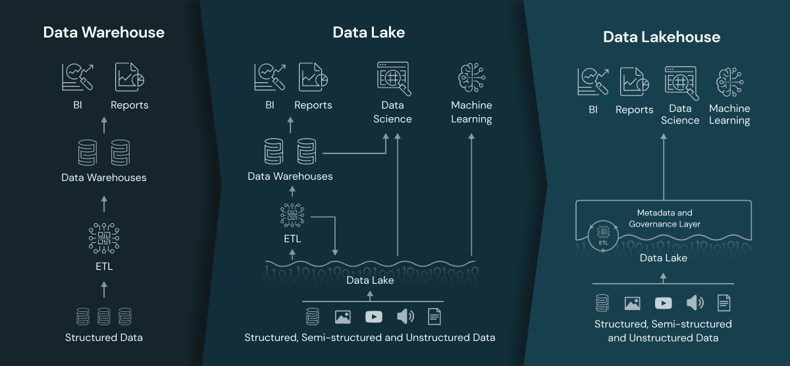
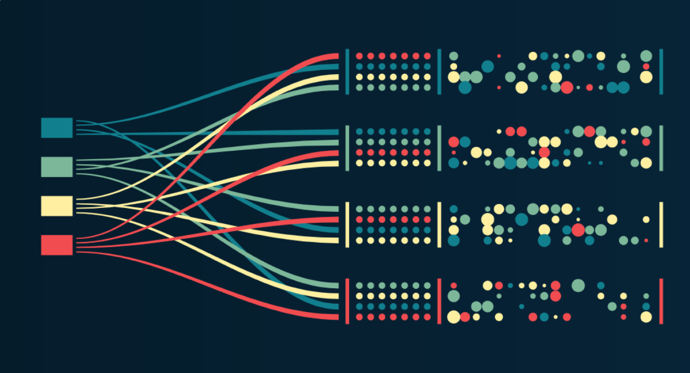
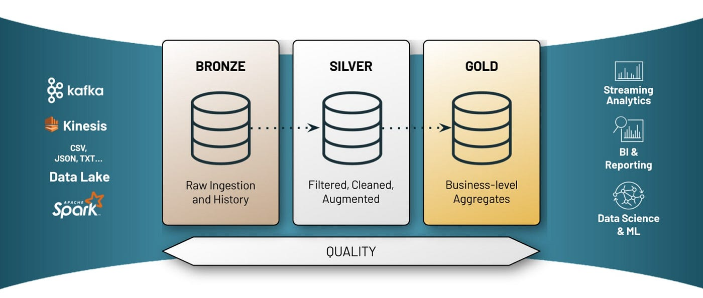

Laktory embraces a few key design and data architecture principles.
Being familiar with these principles will help understand how Laktory is structured. 
Although most of them are not enforced, they generally enable scalability in your data management. 

## Lakehouse
Laktory is all about building lakehouses. But what exactly is a lakehouse?

A Lakehouse is a data management architecture that combines features from data lakes and data warehouses. It addresses the limitations of these traditional approaches by enforcing a schema on read, allowing for schema flexibility, and supporting transactions. This architecture provides a unified platform for storing and processing both raw and structured data, offering the scalability of data lakes and the efficient querying capabilities of data warehouses. The Lakehouse concept aims to streamline data management, making it easier for organizations to handle diverse data types and perform analytics within a single environment.

Unlike traditional data warehouses that enforce a schema on write, a Lakehouse processes data when it's read, allowing for greater flexibility in handling different data formats. This approach enables organizations to manage and analyze both raw and processed data within the same system, eliminating the need to move data between disparate storage and processing environments. With the ability to enforce consistency and reliability through transaction support, Lakehouses offer a comprehensive solution for modern data management needs.

The Lakehouse architecture leverages cost-effective storage solutions for storing raw data, similar to data lakes, while providing efficient querying capabilities akin to data warehouses. This combination of features makes Lakehouses well-suited for handling large-scale data storage and analytics, offering a unified and scalable solution that addresses the evolving requirements of data-driven organizations. Tools like Apache Spark, Delta Lake, and platforms like Databricks play a significant role in implementing and popularizing the Lakehouse architecture.

Learn more by watching this [Intro to Data Lakehouse](https://www.youtube.com/watch?v=myLiFw9AUKY) or read by reading this [blog post](https://www.databricks.com/blog/2020/01/30/what-is-a-data-lakehouse.html). 

## Kappa Architecture
The Kappa architecture is a data processing architecture designed for real-time stream processing, and it is an evolution of the Lambda architecture. 
In the Kappa architecture, there is a single stream processing layer that handles both real-time data processing and batch processing. 
The core idea is to simplify the architecture by eliminating the need for separate batch and stream processing systems.

In the Kappa architecture, data is ingested in real-time through a stream processing engine, which processes and transforms the data immediately. This contrasts with the Lambda architecture, where data is initially ingested into a batch layer and then processed in both batch and speed (stream) layers separately. The Kappa architecture acknowledges that the complexities of managing two separate processing paths in the Lambda architecture can be mitigated by using a unified stream processing layer.

One key component in the Kappa architecture is the use of an immutable log or event log, which serves as the system of record for all data. This log retains a complete history of events, enabling data replay and providing a consistent source for both real-time and batch processing. Apache Kafka is a popular choice for implementing the event log in Kappa architectures due to its durability and scalability.

The Kappa architecture simplifies the overall system design and maintenance, making it easier to reason about and manage real-time data processing without the complexities of managing separate batch and stream processing paths.

Learn more by reading this [blog post](https://pradeepl.com/blog/kappa-architecture/).

## Event-based architecture
An event-based data architecture is a design approach where the components of the platform communicate and synchronize through the exchange of events. 
For example, events may include data updates, inserts, or deletions, as well as system alerts or metadata changes. One key aspect of this type of architecture is the immutability of each event. It never gets modified or deleted. 

In a data platform with an event-based architecture, different modules or services act as event producers and consumers.
As data is ingested, processed, or transformed, relevant events are generated and broadcast to notify other components of changes.
This approach enhances the responsiveness and scalability of the data platform by allowing different services to react to data changes in real-time. 
Common patterns within this architecture include event-driven data pipelines, real-time analytics triggered by data events, and the use of event logs for tracking changes and maintaining data consistency.

By adopting an event-based architecture in a data platform, organizations can achieve a more dynamic, loosely-coupled, and adaptive system that efficiently manages and processes data as it evolves over time.

## Change Data Capture
How is it possible to adopt kappa and event-based architectures, while still ingesting or replicating an external system in which data points (or rows) get constantly modified? Say hello to Change Data Capture (CDC).

CDC is a mechanism in database management that identifies and captures changes made to data so that downstream applications can stay synchronized with the evolving dataset. 
It tracks and captures inserts, updates, and deletes in real-time or near real-time, enabling efficient data replication, synchronization, and extraction of incremental changes without having to reload the entire dataset.

In the context of the Kappa architecture, CDC plays a pivotal role in ensuring that the single stream processing layer efficiently handles real-time data changes. 
By integrating CDC into the Kappa architecture, organizations can achieve a seamless and unified approach to processing both historical and real-time data. 
CDC events are ingested into the stream, and the stream processing layer applies the necessary transformations, aggregations, and analytics.

## Medallion Architecture
A medallion architecture is a data design pattern used to logically organize data in a lakehouse, with the goal of incrementally and progressively improving the structure and quality of data as it flows through each layer of the architecture.

### Bronze
The Bronze layer is where we land all the data from external source systems.
The table structures in this layer correspond to the source system table structures "as-is," along with any additional metadata columns that capture the load date/time, process ID, etc. 
The focus in this layer is quick Change Data Capture and the ability to provide an historical archive of source (cold storage), data lineage, auditability, reprocessing if needed without rereading the data from the source system.

### Silver
In the Silver layer of the lakehouse, data undergoes "just-enough" matching, merging, conformation, and cleansing from the Bronze layer, creating an "Enterprise view" of key business entities. 
This layer facilitates self-service analytics, ad-hoc reporting, and advanced analytics by bringing diverse data sources into a unified view. 
Following an ELT methodology prioritizing speed, agility, and minimal transformations, the Silver layer serves as a source for Departmental Analysts, Data Engineers, and Data Scientists. 
The Silver Layer employs 3rd-Normal Form-like data models, supporting efficient data modeling and acting as an intermediate step before more complex transformations in the Gold layer.

### Gold
The Gold layer in a lakehouse holds highly refined and aggregated data, powering analytics, machine learning, and production applications. 
These tables represent transformed knowledge, not just information, and are crucial for analysts.
Data shared with customers is typically stored exclusively in the Gold layer.
Regularly scheduled updates control costs and establish SLAs for data freshness. 
Although a lakehouse minimizes deadlock issues, Gold tables are often stored separately to avoid cloud data request limits.
Pre-handling aggregations, joins, and filtering before writing to the Gold layer ensures users experience low-latency query performance.

More details from [Databricks](https://www.databricks.com/glossary/medallion-architecture) and [Microsoft](https://learn.microsoft.com/en-us/azure/databricks/lakehouse/medallion) 

## Data Pipeline
In the lakehouse architecture, a data pipeline is a fundamental component that orchestrates the movement and transformation of data across the Bronze, Silver, and Gold layers.
The pipeline manages the entire lifecycle of data, starting with its ingestion from external sources into the Bronze layer. 
During the transformation phase, data undergoes "just-enough" processing as it moves from the raw form in the Bronze layer to a curated state in the Silver layer.
The pipeline is responsible for coordinating these processes efficiently, ensuring data quality, and maintaining agility in handling diverse data types.

Throughout the entire pipeline, orchestration tools manage the scheduling, monitoring, and execution of tasks, while also handling potential failures.

## Open Source
At Okube, we believe that the quality of open-source software is on-par (and often better) with proprietary solutions.
The lakehouse is built on top of open source projects.

* Spark
* Pandas
* Delta Lake
* Delta Sharing
* MLFlow

Laktory is and will always remain open-source. Hopefully, it will also contribute to this open ecosystem.