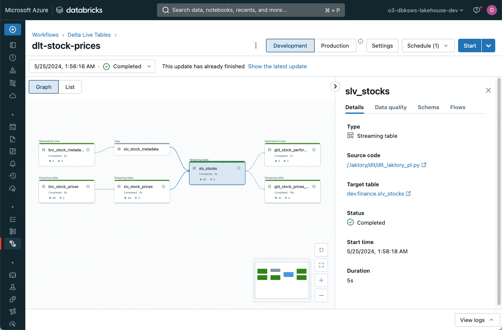
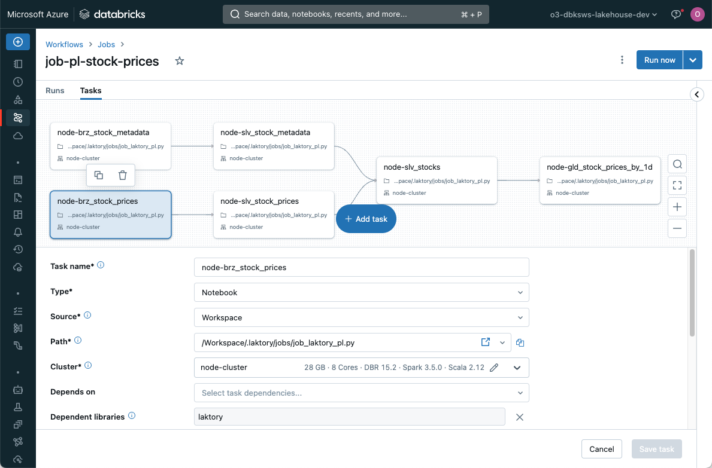

??? "API Documentation"
    [`laktory.models.Pipeline`][laktory.models.Pipeline]<br>
    [`laktory.models.PipelineNode`][laktory.models.PipelineNode]<br>

The Pipeline model is the cornerstone of Laktory. It specifies the process of 
reading, transforming, and writing data.


A pipeline is structured as a sequence of nodes. Each node generates a Spark 
or Polars dataframe by reading a source, applying transformations, and
optionally writing the output to a sink.


As any other Laktory resource, a pipeline is defined from a YAML configuration
file. 

```yaml
name: stock_prices
nodes:
  - name: brz_stock_prices
    layer: BRONZE
    source:
      path: "./events/stock_prices"
    sink:
      schema_name: finance
      table_name: brz_stock_prices
    transformer: 
      nodes: []
  - name: slv_stock_prices
    layer: SILVER
    source:
      node_name: brz_stock_prices
    sink:
      schema_name: finance
      table_name: brz_stock_prices
    transformer:
        nodes:
          - func_name: select
            func_args:
              - timestamp
              - symbol
              - open
              - close
              - high
              - low
              - volume
          - func_name: drop_duplicates
            func_kwargs:
              subset:
                - symbol
                - timestamp
  ...
```

### Sources and Sinks


Laktory supports a variety of [sources and sinks](./sources.md), including
data files and data warehouse tables. By designating a node as the source for
another downstream node, you create dependencies between nodes, enabling the
construction of a directed acyclic graph (DAG).

### Transformer


Transformations are defined through a [chain](./transformers.md) of Spark 
(or Polars) function calls, offering a highly scalable, flexible, and 
customizable framework. Usage of Spark and Spark Streaming also 
enables streaming operations.

### Serialization
The entire pipeline definition is serializable, ensuring high portability for 
deployment on remote compute environments. This feature makes Laktory an ideal 
candidate for a DataOps approach using infrastructure as code.

## Layers
A pipeline node allows you to select the target [medallion architecture](../design.md/#medallion-architecture)
layer (`BRONZE`, `SILVER`, `GOLD`). Basic transformations are automatically 
preset based on the selected layer. For example, `SILVER` dataframes will,
by default, drop source columns and duplicates.

## Orchestrators
The `pipeline.execute()` command allows you to run your data transformations 
either locally or on a remote server. It processes each node sequentially, 
reading data from the source, applying transformations, and writing to the
sink if applicable. It supports streaming operations through [Apache Spark
Structured Streaming]((https://spark.apache.org/docs/latest/structured-streaming-programming-guide.html))
, various output formats and write modes through sink configuration.

However, choosing an orchestrator can unlock more advanced features such as 
parallel processing of nodes, automatic schema management, and historical
re-processing. You can select and configure the desired orchestrator directly 
within the pipeline configuration.

```yaml title="pipeline.yaml"
- name: stock_prices
  nodes: ...
  orchestrator: DLT
  dlt:
    catalog: dev
    target: finance
    configuration:
      pipeline_name: dlt-stock-prices
    
    clusters:
    - name : default
      node_type_id: Standard_DS3_v2
      autoscale:
        min_workers: 1
        max_workers: 2
    
    libraries:
    - notebook:
        path: /.laktory/dlt/dlt_laktory_pl.py
```

The choice of orchestrator determines which resources are deployed when 
running the `laktory deploy` CLI command. 

### Delta Live Tables (DLT)
[Databricks Delta Live Tables](https://www.databricks.com/product/delta-live-tables)
is the recommended orchestrator as it provides the most feature-rich 
experience. Key features include automatic schema change management, data 
quality checks, continuous execution, error handling, failure recovery, and
autoscaling.



A Laktory pipeline integrates with DLT by executing each node inside a
`dlt.table()` or `dlt.view()` decorated function and returning the output
dataframe. 

In the context of DLT, node execution does not trigger a sink write, as this
operation is managed by DLT. When a source is a pipeline node, 
`dlt.read()` and `dlt.read_stream()` functions are called to ensure 
compatibility with the DLT framework. 


```py title="dlt_laktory_pl"
from laktory import dlt
from laktory import models

with open("pipeline.yaml") as fp:
    pl = models.Pipeline.model_validate_yaml(fp.read())


def define_table(node):
    @dlt.table_or_view(
        name=node.name,
        comment=node.description,
        as_view=node.sink is None,
    )
    @dlt.expect_all(node.warning_expectations)
    @dlt.expect_all_or_drop(node.drop_expectations)
    @dlt.expect_all_or_fail(node.fail_expectations)
    def get_df():

        # Execute node
        df = node.execute(spark=spark)

        # Return
        return df

    return get_df


# Build nodes
for node in pl.nodes:
    wrapper = define_table(node)
    df = dlt.get_df(wrapper)
    display(df)
```

Notice how `dlt` module is imported from laktory as it provides additional
debugging and inspection capabilities. Notably, you can run the notebook in a
user cluster and will be able to inspect the resulting dataframe.


### Databricks Job
A [Databricks Job](https://docs.databricks.com/en/workflows/jobs/create-run-jobs.html)
is another great orchestration mechanism. In this case, Laktory will create a 
task for each node, enabling parallel execution of nodes. Each reading and 
writing operation is entirely handled by Laktory source and sink. 



The supporting notebook simply needs to load the pipeline model and retrieve
the node name from the job.

```py title="job_laktory_pl"
dbutils.widgets.text("pipeline_name", "pl-stock-prices")
dbutils.widgets.text("node_name", "")

from laktory import models
from laktory import settings

# --------------------------------------------------------------------------- #
# Read Pipeline                                                               #
# --------------------------------------------------------------------------- #

pl_name = dbutils.widgets.get("pipeline_name")
node_name = dbutils.widgets.get("node_name")
filepath = f"/Workspace{settings.workspace_laktory_root}pipelines/{pl_name}.json"
with open(filepath, "r") as fp:
    pl = models.Pipeline.model_validate_json(fp.read())


# --------------------------------------------------------------------------- #
# Execution                                                                   #
# --------------------------------------------------------------------------- #

if node_name:
    pl.nodes_dict[node_name].execute(spark=spark)
else:
    pl.execute(spark=spark)
```

### Apache Airflow
Supporting Apache Airflow as an orchestrator is currently under development and
will be released soon.

## Streaming
The event-based and kappa architectures promoted by Laktory are well-suited for
Spark Structured Streaming. This real-time data processing framework enables 
continuous, scalable, and fault-tolerant processing of data streams.

By setting `as_stream: True` in a pipeline node data source, the resulting
dataframe will be streaming in nature, processing only new rows of data at
each run instead of re-processing the entire dataset.

Streaming does not mean the pipeline is continuously running. Execution can
still be scheduled, but each run is incremental. Currently, the only way to
deploy a continuously running pipeline is by selecting the Delta Live Tables
orchestrator with `continuous: True`.

For more information about streaming data, consider reading this 
[blog post](https://www.linkedin.com/pulse/mastering-streaming-data-pipelines-kappa-architecture-olivier-soucy-0gjgf/).