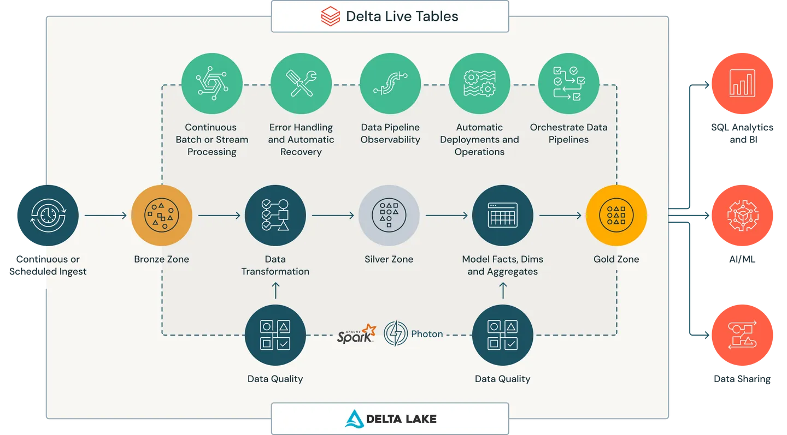
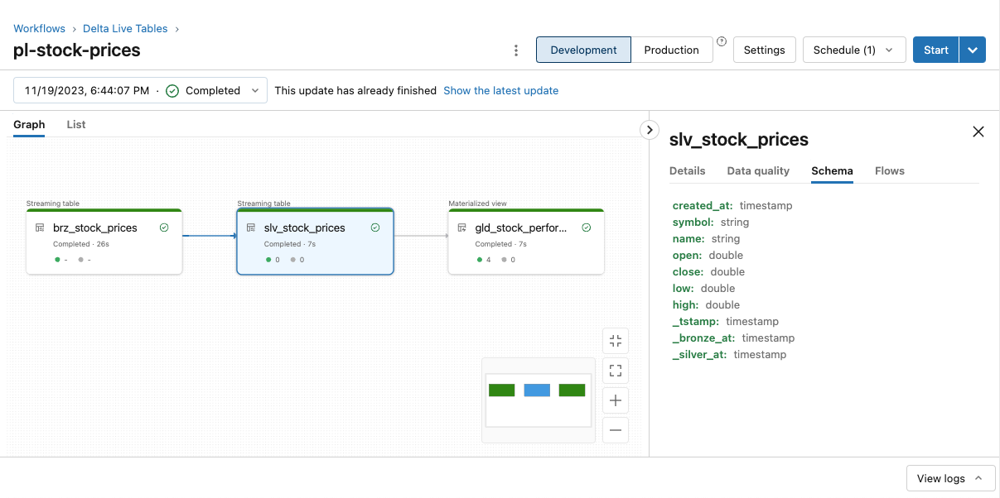

??? "API Documentation"
    [`laktory.models.Pipeline`][laktory.models.Pipeline]<br>

From all the models, `Pipeline` is without a doubt the most critical and fundamental one for building a Lakehouse.

## Delta Live Tables (DLT)
The main purpose of the `Pipeline` model is to declare a [Databricks Delta Live Tables](https://www.databricks.com/product/delta-live-tables) object, a declarative ETL framework that helps simplify streaming and batch transformations.
Simply define the transformations to perform on your data and let DLT pipelines automatically manage task orchestration, cluster management, monitoring, data quality and error handling.
Delta Live Tables are immensely powerful and greatly simplify the process of brining raw data into actionable analytics.



## Tables
The added value of using Laktory for setting up Delta Live Tables is the ability to not only select the notebooks associated with the pipeline, but also directly declares the expected tables and columns.
Each bronze and silver table will be built using a definition from the configuration file and a template notebook.

First, let's have a look at the notebook template for silver tables:
```py title="dlt_slv_template.py"
from laktory import dlt
from laktory import read_metadata
from laktory import get_logger

dlt.spark = spark
logger = get_logger(__name__)

# Read pipeline definition
pl_name = spark.conf.get("pipeline_name", "pl-stock-prices")
pl = read_metadata(pipeline=pl_name)


# Define table
def define_table(table):
    @dlt.table(name=table.name, comment=table.comment)
    def get_df():
        logger.info(f"Building {table.name} table")

        # Read Source
        df = table.builder.read_source(spark)
        df.printSchema()

        # Process
        df = table.builder.process(df, spark=spark)

        # Return
        return df

    return get_df


# --------------------------------------------------------------------------- #
# Execution                                                                   #
# --------------------------------------------------------------------------- #

# Build tables
for table in pl.tables:
    if table.layer == "SILVER":
        wrapper = define_table(table)
        df = dlt.get_df(wrapper)
        display(df)
```
A few things to notice:

* `dlt` module is imported from Laktory as it will provide additional debugging and inspection capabilities
* notebook is completely generic and can process any silver table
* within the context of the notebook, an instance name `pl` of the `models.Pipeline` class is created
* the information required to read source data, build new columns, etc. is all stored within that `pl` object

Let's see how this is declared in the configuration file
```yaml title="pipeline.yaml"
name: pl-stock-prices

catalog: dev
target: finance

clusters:
  - name : default
    node_type_id: Standard_DS3_v2
    autoscale:
      min_workers: 1
      max_workers: 2

libraries:
  - notebook:
      path: /pipelines/dlt_brz_template.py
  - notebook:
      path: /pipelines/dlt_slv_template.py
  - notebook:
      path: /pipelines/dlt_gld_stock_performances.py

permissions:
  - group_name: account users
    permission_level: CAN_VIEW
  - group_name: role-engineers
    permission_level: CAN_RUN

# --------------------------------------------------------------------------- #
# Tables                                                                      #
# --------------------------------------------------------------------------- #

tables:
  - name: brz_stock_prices
    timestamp_key: data.created_at
    builder:
      layer: BRONZE
      event_source:
        name: stock_price
        producer:
          name: yahoo-finance
        read_as_stream: True

  - name: slv_stock_prices
    timestamp_key: created_at
    builder:
      layer: SILVER
      table_source:
        name: brz_stock_prices
        read_as_stream: True
    columns:
      - name: created_at
        type: timestamp
        spark_func_name: coalesce
        spark_func_args:
          - data._created_at

      - name: symbol
        type: string
        spark_func_name: coalesce
        spark_func_args:
          - data.symbol

      - name: open
        type: double
        spark_func_name: coalesce
        spark_func_args:
          - data.open

      - name: close
        type: double
        spark_func_name: coalesce
        spark_func_args:
          - data.close
```
 
As you can see:

* Each bronze and silver table is explicitly defined, including:
    * The source of data
    * The desired output columns
    * How to build these columns

And the final result:


More details on how to define a table from a configuration file is available [here](table.md)

## Streaming
The event-based and kappa architectures promoted by Laktory lend themselves very well for Spark structured streaming, a real-time data processing framework that enables continuous, scalable, and fault-tolerant processing of data streams. 
Databricks extends Spark's capabilities to handle structured streaming seamlessly. 
Unlike traditional batch processing, where data is processed in fixed intervals, structured streaming allows for the continuous processing of data as it arrives.

This concept is easy to apply with DLT and Laktory. 
Simply ensure that the `read_as_stream` option is set to `True` for each data source (this is available for both event and table sources).
New rows of data will be process as they are ingested instead of re-processing the entire data set for each pipeline run.

## Scheduled vs Continuous
Streaming tables do not mean that the pipeline is continuous running. Tables update can be scheduled, but each run will only process new data.
That being said, DLT makes it very easy to run pipelines continuously. Simply set `continuous: True` in your pipeline configuration file and data will be process immediately as it arrives.