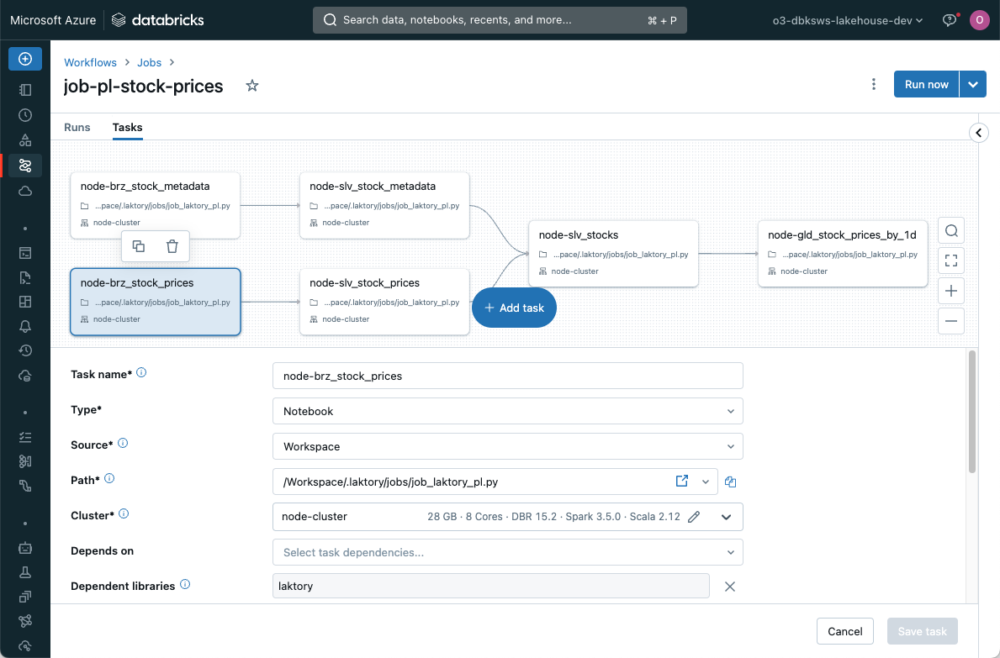
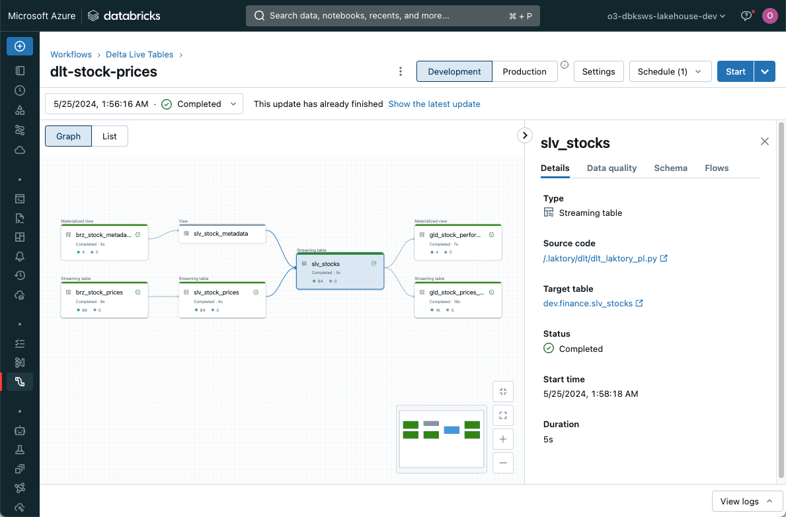

??? "API Documentation"
    [`laktory.models.Pipeline`][laktory.models.Pipeline]<br>

The Pipeline model is the cornerstone of Laktory, orchestrating the process of reading, transforming, and writing data. 
It is built around the concept of the DataFrame—a two-dimensional, tabular data structure with labeled rows and 
columns—commonly used in data analysis for efficient data manipulation. While Pandas, Spark, and Polars are popular 
DataFrame backends, Laktory primarily operates on [Narwhals DataFrames](https://narwhals-dev.github.io/narwhals/basics/dataframe/).
This abstraction allows seamless integration with multiple engines (e.g., Spark, Polars) and enables selecting the most
suitable backend for each operation.


## Pipeline Node
??? "API Documentation"
    [`laktory.models.PipelineNode`][laktory.models.PipelineNode]<br>

A pipeline is composed of a sequence of nodes, each designed to generate a Spark or Polars DataFrame. Each node reads
from a designated source, applies specified transformations, and optionally writes the result to one or more sinks.


## Sources and Sinks


Laktory supports a variety of [sources and sinks](./sources.md), including data files and data tables. By linking 
a node as the source for a downstream node, you establish dependencies, creating a directed acyclic graph (DAG).

## Transformer


The transformations are defined through a [transformer](./transformers.md) which is a chain of SQL statements and/or 
DataFrame API function calls. This flexible and highly modular framework supports scalable batch and
streaming operations.

## Expectations


Data quality is achieved through the use of [expectations](./dataquality.md) and corresponding actions, which can drop,
quarantine, or even halt pipelines if invalid data is detected before it reaches the output.

## Declaration
Because a pipeline definition is entirely serializable, it can be declared as Python code or as a YAML file. The latter
provides the required portability for deployment on remote compute environments. 
This makes Laktory ideal for a [DataOps](./dataops.md) approach using infrastructure-as-code principles.

Here is an example of a pipeline declaration:

=== "YAML"
    
    ```yaml
    name: pl-stock-prices
    dataframe_backend: POLARS

    nodes:
    - name: brz_stock_prices
      source:
        path: ./data/stock_prices/
        format: JSONL
      sinks:
      - path: ./data/brz_stock_prices.parquet
        format: PARQUET

    - name: slv_stock_prices
      source:
        node_name: brz_stock_prices
        as_stream: false
      sinks:
      - path: ./data/slv_stock_prices.parquet
        format: PARQUET
      transformer:
        nodes:
        - expr: |
            SELECT
              CAST(data.created_at AS TIMESTAMP) AS created_at,
              data.symbol AS name,
              data.symbol AS symbol,
              data.open AS open,
              data.close AS close,
              data.high AS high,
              data.low AS low,
              data.volume AS volume
            FROM
              {df}
        - func_name: unique
          func_kwargs:
            subset:
              - symbol
              - created_at
            keep:
              any
    ```

=== "Python"
    ```py
    import laktory as lk
    
    brz = lk.models.PipelineNode(
        name="brz_stock_prices",
        source=lk.models.FileDataSource(
            path="./data/stock_prices/",
            format="JSONL",
        ),
        sinks=[
            lk.models.FileDataSink(
                path="./data/brz_stock_prices.parquet",
                format="PARQUET",
            )
        ],
    )
    
    
    slv = lk.models.PipelineNode(
        name="slv_stock_prices",
        source=lk.models.PipelineNodeDataSource(node_name="brz_stock_prices"),
        sinks=[
            lk.models.FileDataSink(
                path="./data/slv_stock_prices.parquet",
                format="PARQUET",
            )
        ],
        transformer={
            "nodes": [
                lk.models.DataFrameExpr(
                    expr="""
                     SELECT
                          CAST(data.created_at AS TIMESTAMP) AS created_at,
                          data.symbol AS name,
                          data.symbol AS symbol,
                          data.open AS open,
                          data.close AS close,
                          data.high AS high,
                          data.low AS low,
                          data.volume AS volume
                        FROM
                          {df}
                    """
                ),
                lk.models.DataFrameMethod(
                    func_name="unique",
                    func_kwargs={
                        "subset": ["symbol", "created_at"],
                        "keep": "any"
                    }
                )
            ]
        }
    )
    
    pl = lk.models.Pipeline(
        name="pl-stock-prices",
        dataframe_backend="POLARS",
        nodes=[brz, slv],
    )
    ```

## Execution
### Local
You can execute the pipeline in a local or remote Spark session using the `pipeline.execute()` command. If Polars 
is the DataFrame engine, the pipeline can run in a simple Python environment without external dependencies. In all
cases, each node processes sequentially: reading data from the source, applying transformations, and writing to the
sink.

```py
from laktory import models

with open("pipeline.yaml") as fp:
    pl = models.Pipeline.model_validate(fp)
        
pl.execute()
print(pl.nodes_dict["slv_stock_prices"].output_df.to_native().collect())
```

<div class="code-output">
```commandline title="output"
[laktory] Executing pipeline node slv_stock_prices
[laktory] Reading `PipelineNodeDataSource` brz_stock_prices with DataFrameBackends.POLARS
[laktory] Reading pipeline node brz_stock_prices from output DataFrame
[laktory] Read completed.
[laktory] Executing DataFrame Transformer
[laktory] Executing DataFrame transformer node 0 (DataFrameExpr).
[laktory] DataFrame as 
SELECT
  CAST(data.created_at AS TIMESTAMP) AS created_at,
  data.symbol AS name,
  data.symbol AS symbol,
  data.open AS open,
  data.close AS close,
  data.high AS high,
  data.low AS low,
  data.volume AS volume
FROM
  {df}
[laktory] Executing DataFrame transformer node 1 (DataFrameMethod).
[laktory] Applying df.unique(subset=['symbol', 'created_at'],keep=any)
[laktory] Writing static df to ./data/slv_stock_prices.parquet with format 'PARQUET' and {}
[laktory] Write completed.
┌────────────────┬───────┬────────┬────────────┬────────────┬────────────┬────────────┬────────────┐
│ created_at     ┆ name  ┆ symbol ┆ open       ┆ close      ┆ high       ┆ low        ┆ volume     │
│ ---            ┆ ---   ┆ ---    ┆ ---        ┆ ---        ┆ ---        ┆ ---        ┆ ---        │
│ datetime[μs]   ┆ str   ┆ str    ┆ f64        ┆ f64        ┆ f64        ┆ f64        ┆ f64        │
╞════════════════╪═══════╪════════╪════════════╪════════════╪════════════╪════════════╪════════════╡
│ 2023-04-04     ┆ AMZN  ┆ AMZN   ┆ 103.175003 ┆ 103.129997 ┆ 103.419998 ┆ 103.072502 ┆ 3.998703e6 │
│ 13:30:00       ┆       ┆        ┆            ┆            ┆            ┆            ┆            │
│ 2023-04-06     ┆ MSFT  ┆ MSFT   ┆ 288.859985 ┆ 290.360107 ┆ 291.070007 ┆ 288.700012 ┆ 4.355298e6 │
│ 13:30:00       ┆       ┆        ┆            ┆            ┆            ┆            ┆            │
│ 2023-03-02     ┆ AMZN  ┆ AMZN   ┆ 90.589996  ┆ 90.860001  ┆ 91.004997  ┆ 90.529999  ┆ 4.143251e6 │
│ 12:30:00       ┆       ┆        ┆            ┆            ┆            ┆            ┆            │
│ 2023-10-03     ┆ AMZN  ┆ AMZN   ┆ 125.150002 ┆ 125.580002 ┆ 125.699997 ┆ 124.800003 ┆ 5.416032e6 │
│ 11:30:00       ┆       ┆        ┆            ┆            ┆            ┆            ┆            │
│ 2024-03-05     ┆ AAPL  ┆ AAPL   ┆ 170.785004 ┆ 170.470001 ┆ 170.828705 ┆ 170.149994 ┆ 4.315788e6 │
│ 12:30:00       ┆       ┆        ┆            ┆            ┆            ┆            ┆            │
│ …              ┆ …     ┆ …      ┆ …          ┆ …          ┆ …          ┆ …          ┆ …          │
│ 2023-11-30     ┆ AAPL  ┆ AAPL   ┆ 188.335007 ┆ 188.789993 ┆ 188.830002 ┆ 188.289993 ┆ 2.75059e6  │
│ 13:30:00       ┆       ┆        ┆            ┆            ┆            ┆            ┆            │
│ 2023-03-22     ┆ MSFT  ┆ MSFT   ┆ 275.850006 ┆ 277.049988 ┆ 277.149994 ┆ 275.764008 ┆ 1.790997e6 │
│ 12:30:00       ┆       ┆        ┆            ┆            ┆            ┆            ┆            │
│ 2023-01-12     ┆ GOOGL ┆ GOOGL  ┆ 91.480003  ┆ 91.510002  ┆ 91.870003  ┆ 89.75      ┆ 7.320764e6 │
│ 09:30:00       ┆       ┆        ┆            ┆            ┆            ┆            ┆            │
│ 2023-07-20     ┆ GOOGL ┆ GOOGL  ┆ 120.459999 ┆ 120.059998 ┆ 120.470001 ┆ 119.764999 ┆ 2.94552e6  │
│ 12:30:00       ┆       ┆        ┆            ┆            ┆            ┆            ┆            │
│ 2023-08-22     ┆ AAPL  ┆ AAPL   ┆ 176.922897 ┆ 177.214996 ┆ 177.429993 ┆ 176.310104 ┆ 6.823573e6 │
│ 10:30:00       ┆       ┆        ┆            ┆            ┆            ┆            ┆            │
└────────────────┴───────┴────────┴────────────┴────────────┴────────────┴────────────┴────────────┘
```
</div>

### Spark
If you select `PYSPARK` as the DataFrame backend, Laktory will instantiate 
a default Spark Session, but you can register your own instead. This works using a 
local, a Databricks notebook or Databricks connect Spark Session:
```py title="set_spark.py"
from databricks.connect import DatabricksSession

from laktory import register_spark_session

spark = DatabricksSession.builder.getOrCreate()
register_spark_session(spark)
```

### Orchestrators
While local execution is ideal for small datasets or prototyping, orchestrators unlock more advanced features such as 
parallel processing, automatic schema management, and historical re-processing. The desired orchestrator can be 
configured directly within the pipeline.

```yaml title="pipeline.yaml"
- name: stock_prices
  nodes: ...
  orchestrator: 
    type: DATABRICKS_PIPELINE
    catalog: dev
    target: finance
    
    clusters:
    - name : default
      node_type_id: Standard_DS3_v2
      autoscale:
        min_workers: 1
        max_workers: 2
    
    libraries:
    - notebook:
        path: /.laktory/dlt/dlt_laktory_pl.py
```

The choice of orchestrator determines which resources are deployed when 
running the `laktory deploy` CLI command. 

#### Databricks Job
A [Databricks Job](https://docs.databricks.com/en/workflows/jobs/create-run-jobs.html)
is a powerful orchestration mechanism. In this case, Laktory will create a 
task for each node, enabling parallel execution of nodes. Each reading and 
writing operation is entirely handled by Laktory source and sink. 



Each task will call a Laktory function that will read the pipeline configuration 
and execute a node.

Selecting the `DATABRICKS_JOB` orchestrator will deploy a pipeline json 
configuration file which can be found in your workspace under `/Workspace/{laktory_root}/pipelines/{pipeline_name}/`.

#### Databricks Lakeflow Declarative Pipeline
[Lakeflow Declarative Pipelines](https://www.databricks.com/product/data-engineering/lakeflow-declarative-pipelines)
offers features like automatic schema change management, continuous execution, advanced monitoring and 
autoscaling. 



Each pipeline node runs inside a dlt.table() or dlt.view() function. In the context of Declarative Pipelines, node
execution does not trigger a sink write, as this operation is internally managed by Lakeflow. When a source is a 
pipeline node, `dlt.read()` and `dlt.read_stream()` functions are called to ensure compatibility with the framework.

To use the `DATABRICKS_PIPELINE` orchestrator, you must also add the supporting
[notebook](https://github.com/okube-ai/laktory/blob/main/laktory/resources/quickstart-stacks/workflows/notebooks/dlt/dlt_laktory_pl.py) 
to your stack. 

Here is a simplified version:
```py title="dlt_laktory_pl"
import dlt

import laktory as lk

with open("pipeline.yaml") as fp:
    pl = lk.models.Pipeline.model_validate_yaml(fp.read())


def define_table(node, sink):
    @dlt.table(
        name=sink.dlt_name,
        comment=node.description,
    )
    def get_df():
        # Execute node
        node.execute()
        if sink and sink.is_quarantine:
            df = node.quarantine_df
        else:
            df = node.output_df

        # Return
        return df.to_native()


# Build nodes
for node in pl.nodes:
    for sink in node.sinks:
        wrapper = define_table(node, sink)
        df = lk.dlt.get_df(wrapper)
        display(df)
```

Selecting the `DATABRICKS_PIPELINE` orchestrator will deploy a pipeline json 
configuration file which can be found in your workspace under `/Workspace/{laktory_root}/pipelines/{pipeline_name}/`.

#### Apache Airflow
Support for Apache Airflow as an orchestrator is on the roadmap.

#### Dagster
Support for Dagster as an orchestrator is on the roadmap.

## Streaming Operations

Laktory supports event-based and kappa architectures using [Apache Spark
Structured Streaming]((https://spark.apache.org/docs/latest/structured-streaming-programming-guide.html)) 
for continuous, scalable data processing.

By setting `as_stream: True` in a pipeline node's data source, the DataFrame becomes streaming-enabled, processing only
new rows of data at each run instead of re-processing the entire dataset.

Streaming does not mean the pipeline is continuously running. Execution can still be scheduled, but each run is
incremental. Currently, the only way to deploy a continuously running pipeline is by selecting the Databricks pipeline
orchestrator with `continuous: True`.

For more information about streaming data, consider reading this 
[blog post](https://www.linkedin.com/pulse/mastering-streaming-data-pipelines-kappa-architecture-olivier-soucy-0gjgf/).