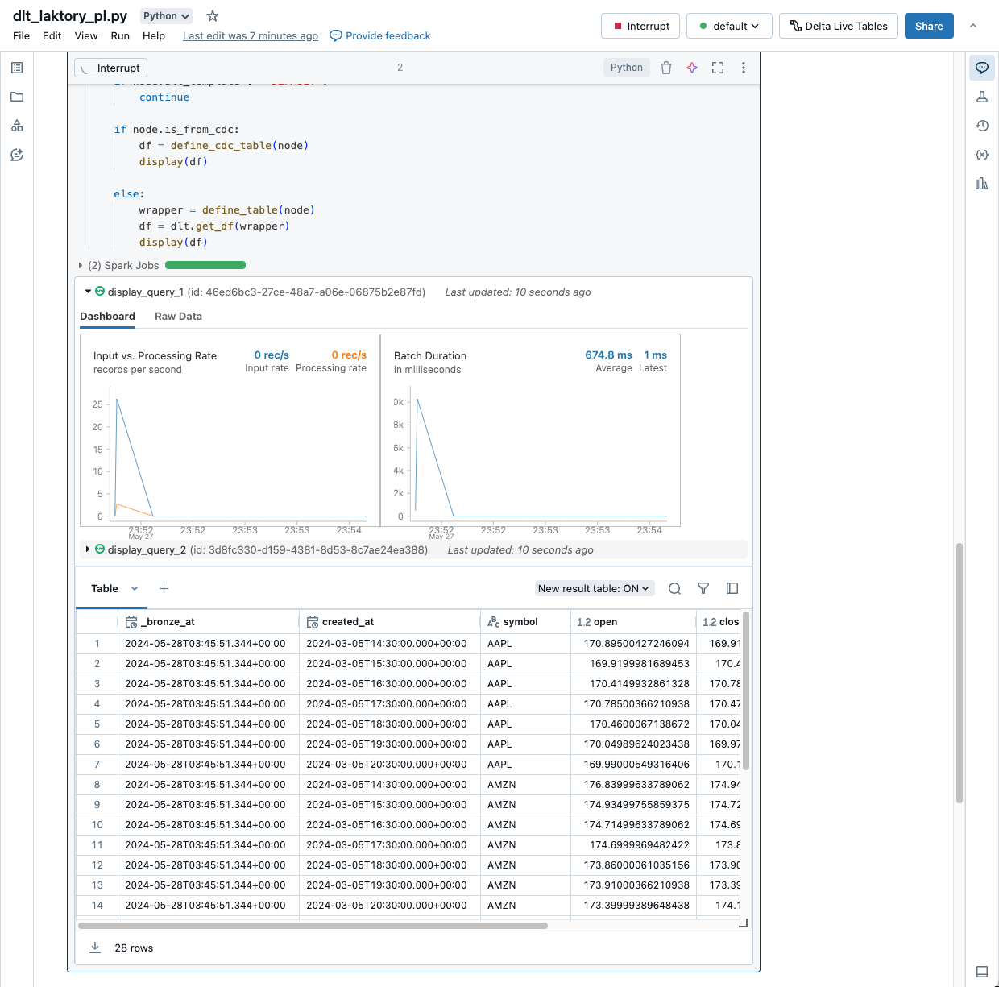

??? "API Documentation"
    [`laktory.models.Pipeline`][laktory.models.Pipeline]<br>

The Pipeline model is the cornerstone of Laktory, facilitating the process of reading, transforming, and writing data.


## Pipeline Node
??? "API Documentation"
    [`laktory.models.PipelineNode`][laktory.models.PipelineNode]<br>

A pipeline is composed of a sequence of nodes, each designed to generate a Spark or Polars DataFrame. Each node reads
from a designated source, applies specified transformations, and optionally writes the result to one or more sinks.


## Sources and Sinks


Laktory supports a variety of [sources and sinks](./sources.md), including data files and warehouse tables. By linking 
a node as the source for a downstream node, you establish dependencies, creating a directed acyclic graph (DAG).

## Transformer


The transformations are defined through a [transformer](./transformers.md) which is a chain of SQL statements and/or 
Spark/Polars DataFrame API function calls. This flexible and highly modular framework supports scalable batch and
streaming operations.

## Expectations


Data quality is achieved through the use of [expectations](./dataquality.md) and corresponding actions, which can drop,
quarantine, or even halt pipelines if invalid data is detected before it reaches the output.

## Serialization
The entire pipeline definition is serializable, ensuring portability for deployment on remote compute environments. 
This makes Laktory ideal for a [DataOps](./dataops.md) approach using infrastructure-as-code principles.

Here is an example of a pipeline declaration:
```yaml
name: stock_prices
nodes:
  - name: brz_stock_prices
    source:
      path: "./events/stock_prices"
    sinks:
    - schema_name: finance
      table_name: brz_stock_prices

  - name: slv_stock_prices
    source:
      node_name: brz_stock_prices
    sinks:
    - schema_name: finance
      table_name: slv_stock_prices
    - schema_name: finance
      table_name: slv_stock_prices_quarantine
      is_quarantine: True
    expectations:
    - name: positive price
      expr: close > 0
      action: QUARANTINE
    transformer:
      nodes:
      - sql_expr: |
            SELECT
              data.created_at AS created_at,
              data.symbol AS symbol,
              data.open AS open,
              data.close AS close,
              data.high AS high,
              data.low AS low,
              data.volume AS volume
            FROM
              {df}
      - func_name: drop_duplicates
        func_kwargs:
          subset:
            - symbol
            - timestamp
  ...
```

[//]: # ()
[//]: # (## Layers)

[//]: # ()
[//]: # (Pipeline nodes allow you to select a target medallion architecture layer &#40;`BRONZE`, `SILVER`, `GOLD`&#41;. Basic )

[//]: # (transformations are preset based on the selected layer. For example, `SILVER` nodes automatically drop unnecessary )

[//]: # (columns and duplicates by default.)

## Execution
### Local
You can execute the pipeline in a local or remote Spark session using the `pipeline.execute(spark)` command. If Polars 
is the DataFrame engine, the pipeline can run in a simple Python environment without external dependencies. In all
cases, each node processes sequentially: reading data from the source, applying transformations, and writing to the
sink.

```py
from laktory import models

with open("pipeline_node.yaml") as fp:
    node = models.PipelineNode.model_validate(fp)

node.execute(spark)
node.output_df.laktory.display()
```

<div class="code-output">
```commandline title="output"
laktory.models.pipelinenode - INFO - Executing pipeline node slv_stock_prices (None)
laktory.models.datasources.filedatasource - INFO - Reading /Volumes/dev/sources/landing/tables/brz_stock_prices/ as static
laktory.models.transformers.basechain - INFO - Executing SPARK chain
laktory.models.transformers.basechain - INFO - Executing SPARK chain node 0 (SparkChainNode).
laktory.models.transformers.sparkchainnode - INFO - DataFrame df as 
SELECT
  data.created_at AS created_at,
  data.symbol AS symbol,
  data.open AS open,
  data.close AS close,
  data.high AS high,
  data.low AS low,
  data.volume AS volume
FROM
  {df}
laktory.models.transformers.basechain - INFO - Executing SPARK chain node 1 (SparkChainNode).
laktory.models.transformers.sparkchainnode - INFO - DataFrame df as drop_duplicates(subset=['symbol', 'created_at'])
laktory.models.datasinks.filedatasink - INFO - Writing df as static DELTA to finance.slv_stock_prices with mode OVERWRITE and options {'mergeSchema': 'false', 'overwriteSchema': 'true'}
+-------------------------+------+------------------+------------------+------------------+------------------+---------+
|created_at               |symbol|open              |close             |high              |low               |volume   |
+-------------------------+------+------------------+------------------+------------------+------------------+---------+
|2023-07-06T11:30:00-04:00|MSFT  |338.7200012207031 |341.6199951171875 |341.6600036621094 |338.4200134277344 |2850613.0|
|2023-02-15T13:30:00-05:00|AAPL  |154.3800048828125 |155.2321014404297 |155.32550048828125|154.14999389648438|6005631.0|
|2023-02-15T10:30:00-05:00|MSFT  |268.0098876953125 |267.9599914550781 |268.6300048828125 |266.5299987792969 |5300365.0|
|2023-10-18T13:30:00-04:00|MSFT  |332.7200012207031 |331.54998779296875|332.7200012207031 |330.739990234375  |2036767.0|
|2023-10-19T12:30:00-04:00|AAPL  |176.69000244140625|177.47999572753906|177.83999633789062|175.4600067138672 |7575857.0|
|2023-05-16T11:30:00-04:00|AMZN  |113.59500122070312|114.4832992553711 |114.48999786376953|113.2750015258789 |8034165.0|
|2023-07-06T10:30:00-04:00|MSFT  |340.5799865722656 |338.70001220703125|341.1199951171875 |338.0899963378906 |3748565.0|
|2023-03-30T10:30:00-04:00|GOOGL |100.59500122070312|100.4749984741211 |100.875           |100.24019622802734|3869214.0|
|2023-01-17T15:30:00-05:00|GOOGL |91.55500030517578 |91.30999755859375 |91.61000061035156 |91.23999786376953 |3977790.0|
|2023-03-22T12:30:00-04:00|AMZN  |99.94010162353516 |100.193603515625  |100.21659851074219|99.83219909667969 |3250304.0|
+-------------------------+------+------------------+------------------+------------------+------------------+---------+
only showing top 10 rows
```
</div>

### Orchestrators
While local execution is ideal for small datasets or prototyping, orchestrators unlock more advanced features such as 
parallel processing, automatic schema management, and historical re-processing. The desired orchestrator can be 
configured directly within the pipeline.

```yaml title="pipeline.yaml"
- name: stock_prices
  nodes: ...
  orchestrator: DLT
  dlt:
    catalog: dev
    target: finance
    configuration:
      pipeline_name: dlt-stock-prices
    
    clusters:
    - name : default
      node_type_id: Standard_DS3_v2
      autoscale:
        min_workers: 1
        max_workers: 2
    
    libraries:
    - notebook:
        path: /.laktory/dlt/dlt_laktory_pl.py
```

The choice of orchestrator determines which resources are deployed when 
running the `laktory deploy` CLI command. 

#### Delta Live Tables (DLT)
[Databricks Delta Live Tables](https://www.databricks.com/product/delta-live-tables)
is the recommended orchestrator, offering features like automatic schema change management, continuous execution, and 
autoscaling. 


Each pipeline node runs inside a dlt.table() or dlt.view() function. In the context of DLT, node execution does not 
trigger a sink write, as this operation is managed by DLT. When a source is a pipeline node, `dlt.read()` and
`dlt.read_stream()` functions are called to ensure compatibility with the DLT framework.

```py title="dlt_laktory_pl"
from laktory import dlt
from laktory import models

with open("pipeline.yaml") as fp:
    pl = models.Pipeline.model_validate_yaml(fp.read())


def define_table(node, sink):
    @dlt.table_or_view(
        name=sink.name,
        comment=node.description,
        as_view=sink is None,
    )
    def get_df():

        logger.info(f"Building {node.name} node | sink: {sink.full_name}")

        # Execute node
        node.execute(spark=spark, udfs=udfs)
        if sink.is_quarantine:
            df = node.quarantine_df
        else:
            df = node.output_df
        df.printSchema()

        # Return
        return df

    return get_df


# Build nodes
for node in pl.nodes:
    for sink in node.sinks:
        wrapper = define_table(node, sink)
        df = dlt.get_df(wrapper)
        display(df)
```

Notice how `dlt` module is imported from laktory as it provides additional
debugging and inspection capabilities. Notably, you can run the notebook in a
user cluster and will be able to inspect the resulting dataframe.




#### Databricks Job
A [Databricks Job](https://docs.databricks.com/en/workflows/jobs/create-run-jobs.html)
is another powerful orchestration mechanism. In this case, Laktory will create a 
task for each node, enabling parallel execution of nodes. Each reading and 
writing operation is entirely handled by Laktory source and sink. 


The supporting notebook simply needs to load the pipeline model and retrieve
the node name from the job.

```py title="job_laktory_pl"
dbutils.widgets.text("pipeline_name", "pl-stock-prices")
dbutils.widgets.text("node_name", "")

from laktory import models
from laktory import settings

# --------------------------------------------------------------------------- #
# Read Pipeline                                                               #
# --------------------------------------------------------------------------- #

pl_name = dbutils.widgets.get("pipeline_name")
node_name = dbutils.widgets.get("node_name")
filepath = f"/Workspace{settings.workspace_laktory_root}pipelines/{pl_name}.json"
with open(filepath, "r") as fp:
    pl = models.Pipeline.model_validate_json(fp.read())


# --------------------------------------------------------------------------- #
# Execution                                                                   #
# --------------------------------------------------------------------------- #

if node_name:
    pl.nodes_dict[node_name].execute(spark=spark)
else:
    pl.execute(spark=spark)
```

#### Apache Airflow
Support for Apache Airflow as an orchestrator is on the roadmap.

#### Dagster
Support for Dagster as an orchestrator is on the roadmap.

## Streaming Operations

Laktory supports event-based and kappa architectures using [Apache Spark
Structured Streaming]((https://spark.apache.org/docs/latest/structured-streaming-programming-guide.html)) 
for continuous, scalable data processing.

By setting `as_stream: True` in a pipeline node's data source, the DataFrame becomes streaming-enabled, processing only
new rows of data at each run instead of re-processing the entire dataset.

Streaming does not mean the pipeline is continuously running. Execution can still be scheduled, but each run is
incremental. Currently, the only way to deploy a continuously running pipeline is by selecting the Delta Live Tables
orchestrator with `continuous: True`.

For more information about streaming data, consider reading this 
[blog post](https://www.linkedin.com/pulse/mastering-streaming-data-pipelines-kappa-architecture-olivier-soucy-0gjgf/).