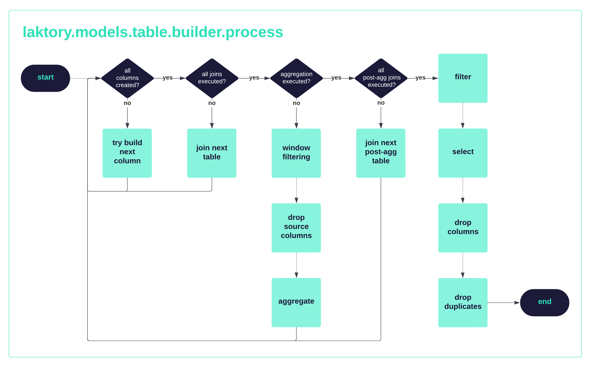

??? "API Documentation"
    [`laktory.models.TableBuilder`][laktory.models.TableBuilder]<br>

The `TableBuilder` model is a core component of Laktory that provides the mechanisms for building highly complex tables from simple configuration.
It supports data input, columns creation, joins and aggregations. 

### Layers
The table builder lets you input a target layer (`BRONZE`, `SILVER`, `GOLD`) that define some custom options. 
For example the `SILVER` tables will drop source columns and duplicates by default.
The layer also sets the default notebook template.
Each of these default may also be overwritten, regardless of the `layer` value.


### Data Sources
The `DataSource` models facilitate loading data into a spark DataFrame. 
It provides re-usable mechanisms for reading data of various nature given different configuration.

#### Event Data Source
??? "API Documentation"
    [`laktory.models.EventDataSource`][laktory.models.EventDataSource]<br>

This type of data source supports reading multiple files stored on a storage container
```py
from laktory import models

source = models.EventDataSource(
    name="stock_price",
    producer={"name": "yahoo-finance"},
    fmt="JSON",
    read_as_stream=False,
)
df = source.read()
```

Reading the same dataset, but as a spark streaming source, is as easy as changing `read_as_stream` to `True`.
```py
from laktory import models

source = models.TableDataSource(
    name="stock_price",
    producer={"name": "yahoo-finance"},
    fmt="JSON",
    read_as_stream=True,
)
df_stream = source.read()
```

#### Table Data Source
??? "API Documentation"
    [`laktory.models.TableDataSource`][laktory.models.TableDataSource]<br>
When your data is already loading into a table, you can use the `TableDataSource` model instead
```py
from laktory import models

source = models.EventDataSource(
    name="brz_stock_prices",
    selects=["symbol", "open", "close"],
    filter="symbol='AAPL'",
    from_pipeline=False,
    read_as_stream=True,
)
df = source.read()
```
In this case

* the `selects` argument is used to select only `symbol`, `open` and `close` columns
* the `filter` argument is used to select only rows associated with Apple stock. 
* the `from_pipeline` argument can be used in the context of a data [pipeline](pipeline.md) to reference another table part of the same pipeline.  

More data sources (like Kafka / Event Hub / Kinesis streams) will be supported in the future.


### Columns
??? "API Documentation"
    [`laktory.models.Column`][laktory.models.Column]<br>

A table builder supports the creation of the columns defined in the `Table` model.

```py
from laktory import models

table = models.Table(
    name="slv_stock_prices",
    columns=[
        {"name": "symbol", "type": "string", "sql_expression": "data.symbol"},
        {
            "name": "open",
            "type": "double",
            "spark_func_name": "coalesce",
            "spark_func_args": ["daa.open"],
        },
        {
            "name": "close",
            "type": "double",
            "spark_func_name": "coalesce",
            "spark_func_args": ["daa.close"],
        },
    ],
    builder={
        "layer": "SILVER",
        "table_source": {
            "name": "brz_stock_prices",
        },
    },
)

# Read
df = table.builder.read_source(spark)

# Process
df = table.builder.process(df, spark)
```
In the example above, the columns `symbol`, `open` and `close` will be created using their provided definition and the data source.
Note that each column may be defined as an SQL expression or as the output of a spark function.

### Joins
??? "API Documentation"
    [`laktory.models.TableJoin`][laktory.models.TableJoin]<br>
For silver star and gold tables, we often need to join multiple datasets.
```py
from laktory import models

table = models.Table(
    name="slv_star_stock_prices",
    builder={
        "layer": "SILVER_STAR",
        "table_source": {
            "name": "slv_stock_prices",
        },
        "joins": [
            {
                "other": {
                    "name": "slv_stock_metadata",
                    "read_as_stream": False,
                    "selects": [
                        "symbol",
                        "currency",
                        "first_traded",
                    ],
                },
                "on": ["symbol"],
            }
        ],
    },
)

# Read
df = table.builder.read_source(spark)

# Process
df = table.builder.process(df, spark)
```

The source table `slv_stock_prices` acts as the left table in a LEFT JOIN with table `slv_stock_metadata` for which only the `symbol`, `currency` and `first_traded` columns are selected. 
The `selects` statement can also be defined as a dictionary to remap the other column names into new column names before doing the join.

The `joins` argument is a list of joins such that multiple joins can be chained one after the other.

Spark [structured streaming joins](https://spark.apache.org/docs/latest/structured-streaming-programming-guide.html) are supported using a combination of `read_as_stream` options and watermarks declaration. 

### Aggregations
??? "API Documentation"
    [`laktory.models.TableAggregation`][laktory.models.TableAggregation]<br>
Gold tables are all about aggregations. 

```py
from laktory import models

table = models.Table(
    name="gld_stock_prices",
    builder={
        "layer": "GOLD",
        "table_source": {
            "name": "slv_star_stock_prices",
        },
        "aggregation": {
            "groupby_columns": [
                "symbol",
            ],
            "groupby_window": {
                "time_column": "_tstamp",
                "window_duration": "1 day",
            },
            "agg_expressions": [
                {
                    "name": "rows_count",
                    "spark_func_name": "count",
                    "spark_func_args": ["symbol"],
                },
                {
                    "name": "low",
                    "spark_func_name": "min",
                    "spark_func_args": ["low"],
                },
            ],
        },
    },
)

# Read
df = table.builder.read_source(spark)

# Process
df = table.builder.process(df, spark)
```
The source table `slv_star_stock_prices` is grouped by rows sharing the same `symbol` value and the same [time window](https://spark.apache.org/docs/3.1.3/api/python/reference/api/pyspark.sql.functions.window.html).
For each group, the number of rows `count` and the lowest price `low` are computed.

### Window Filter
??? "API Documentation"
    [`laktory.models.TableWindowFilter`][laktory.models.TableWindowFilter]<br>

In some instances, you want the output to be a selection of rows out of groups.

```py
from laktory import models

table = models.Table(
    name="gld_stock_price_performances",
    builder={
        "layer": "GOLD",
        "table_source": {
            "name": "slv_star_stock_prices",
        },
        "window_filter": {
            "partition_by": [
                "symbol",
            ],
            "order_by": [
                {"sql_expression": "created_at", "desc": True},
            ],
            "rows_to_keep": 2,
        },
    },
)

# Read
df = table.builder.read_source(spark)

# Process
df = table.builder.process(df, spark)
```
The 2 (`rows_to_keep`) most recent (`created_at`) rows of each symbol (`partition_by`) will be selected.


### Process
The `TableBuilder.process` method applies all the transformation mentioned above (and more) and returns  the final DataFrame representation of the table.

The above flow chart describes the sequence of the different transformations. 
It is to note that the creation of columns is attempted after

* initial setup
* each table join
* aggregation

This allows to create columns that are required for different context (pre-join, post-join, post-aggregation, etc.) in a single declaration.