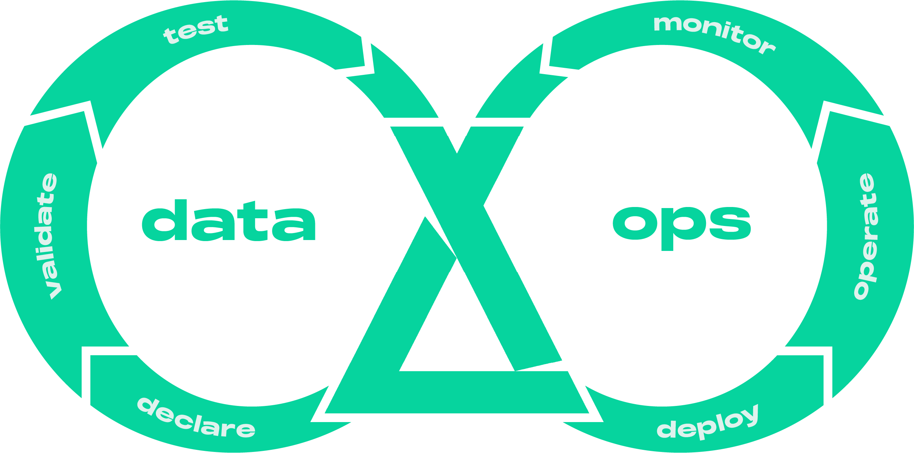

An open-source DataOps and dataframe-centric ETL framework for building 
lakehouses.

## What is it?
Laktory is your all-in-one solution for defining both data transformations and 
Databricks resources. Imagine if Terraform, Databricks Asset Bundles, and dbt
combined forces—that’s essentially Laktory.

This open-source framework simplifies the creation, deployment, and execution 
of data pipelines while adhering to essential DevOps practices like version 
control, code reviews, and CI/CD integration. With Apache Spark and Polars
driving its data transformation, Laktory ensures reliable and scalable data
processing. Its modular, flexible approach allows you to seamlessly combine SQL
statements with DataFrame operations.


Since Laktory pipelines are built on top of Spark and Polars, they can run in
any environment that supports python—from your local machine to a Kubernetes 
cluster. They can also be deployed and orchestrated as Databricks Jobs or
[Delta Live Tables](https://www.databricks.com/product/delta-live-tables),
offering a simple, fully managed, and low-maintenance solution.

But Laktory goes beyond data pipelines. It empowers you to define and deploy 
your entire Databricks data platform—from Unity Catalog and access grants
to compute and quality monitoring—providing a complete, modern solution
for data platform management.

## Why Laktory?
Laktory is designed to accelerate value generation and reduce the total cost of
operations by focusing on four key areas: simplicity, speed, scalability and
quality.

### Simplicity
With Laktory, managing both Databricks resources and data transformations is 
streamlined into a single tool. This empowers your data team to take full 
ownership of the solution, eliminating the need to juggle multiple technologies.
Say goodbye to relying on external Terraform experts to handle compute, workspace
configuration, and Unity Catalog, while your data engineers and analysts try 
to combine Databricks Asset Bundles and dbt to build data pipelines. Laktory
consolidates these functions, simplifying the entire process and reducing
the overall cost.


### Speed
Adopting a [DataOps](concepts/dataops.md) approach and writing data pipelines as code enables faster,
more reliable production releases. With Laktory, you can run and debug your
pipelines directly from your favorite IDE before deploying to Databricks,
allowing for rapid iteration. With Laktory taking care of read, write and DAG
generation, you can concentrate on what matters most—business logic and creating
value—while minimizing boilerplate code.



### Scalability
Scale the right job to the right level. Run on a powerful Spark cluster when 
dealing with large datasets, or experiment locally on your machine with smaller
ones. Switching between environments is effortless with a simple configuration
change, ensuring that Laktory adapts to both small and large-scale needs
without complexity.

### Quality
Elevate data quality to a first-class citizen. Laktory integrates robust data 
quality expectations at both row and aggregate levels, ensuring that only 
trusted data reaches production analytics. Invalid records can trigger pipline
failure, be dropped, or automatically quarantined for later review.

## How does it work?
Using YAML configuration files, define a [stack](concepts/stack.md) of
resources, such as a data [pipelines](concepts/pipeline.md) with SQL-based and
Spark-based transformations. 
### Declare
```yaml title="pipeline_node.yaml"
name: slv_stock_prices
source:
  path: /Volumes/dev/sources/landing/tables/brz_stock_prices/
sinks:
- schema_name: finance
  table_name: slv_stock_prices
transformer:
  nodes:
  - sql_expr: |
        SELECT
          data.created_at AS created_at,
          data.symbol AS symbol,
          data.open AS open,
          data.close AS close,
          data.high AS high,
          data.low AS low,
          data.volume AS volume
        FROM
          {df}
  - func_name: drop_duplicates
    func_kwargs:
      subset:
        - symbol
        - timestamp
...
```
### Debug
Execute your pipline from your IDE using python and a local or remote Spark
session.
```py
from laktory import models

with open("pipeline_node.yaml") as fp:
    node = models.PipelineNode.model_validate(fp)

node.execute(spark)
node.output_df.laktory.display()
```

<div class="code-output">
```commandline title="output"
laktory.models.pipelinenode - INFO - Executing pipeline node slv_stock_prices (None)
laktory.models.datasources.filedatasource - INFO - Reading /Volumes/dev/sources/landing/tables/brz_stock_prices/ as static
laktory.models.transformers.basechain - INFO - Executing SPARK chain
laktory.models.transformers.basechain - INFO - Executing SPARK chain node 0 (SparkChainNode).
laktory.models.transformers.sparkchainnode - INFO - DataFrame df as 
SELECT
  data.created_at AS created_at,
  data.symbol AS symbol,
  data.open AS open,
  data.close AS close,
  data.high AS high,
  data.low AS low,
  data.volume AS volume
FROM
  {df}
laktory.models.transformers.basechain - INFO - Executing SPARK chain node 1 (SparkChainNode).
laktory.models.transformers.sparkchainnode - INFO - DataFrame df as drop_duplicates(subset=['symbol', 'created_at'])
laktory.models.datasinks.filedatasink - INFO - Writing df as static DELTA to finance.slv_stock_prices with mode OVERWRITE and options {'mergeSchema': 'false', 'overwriteSchema': 'true'}
+-------------------------+------+------------------+------------------+------------------+------------------+---------+
|created_at               |symbol|open              |close             |high              |low               |volume   |
+-------------------------+------+------------------+------------------+------------------+------------------+---------+
|2023-07-06T11:30:00-04:00|MSFT  |338.7200012207031 |341.6199951171875 |341.6600036621094 |338.4200134277344 |2850613.0|
|2023-02-15T13:30:00-05:00|AAPL  |154.3800048828125 |155.2321014404297 |155.32550048828125|154.14999389648438|6005631.0|
|2023-02-15T10:30:00-05:00|MSFT  |268.0098876953125 |267.9599914550781 |268.6300048828125 |266.5299987792969 |5300365.0|
|2023-10-18T13:30:00-04:00|MSFT  |332.7200012207031 |331.54998779296875|332.7200012207031 |330.739990234375  |2036767.0|
|2023-10-19T12:30:00-04:00|AAPL  |176.69000244140625|177.47999572753906|177.83999633789062|175.4600067138672 |7575857.0|
|2023-05-16T11:30:00-04:00|AMZN  |113.59500122070312|114.4832992553711 |114.48999786376953|113.2750015258789 |8034165.0|
|2023-07-06T10:30:00-04:00|MSFT  |340.5799865722656 |338.70001220703125|341.1199951171875 |338.0899963378906 |3748565.0|
|2023-03-30T10:30:00-04:00|GOOGL |100.59500122070312|100.4749984741211 |100.875           |100.24019622802734|3869214.0|
|2023-01-17T15:30:00-05:00|GOOGL |91.55500030517578 |91.30999755859375 |91.61000061035156 |91.23999786376953 |3977790.0|
|2023-03-22T12:30:00-04:00|AMZN  |99.94010162353516 |100.193603515625  |100.21659851074219|99.83219909667969 |3250304.0|
+-------------------------+------+------------------+------------------+------------------+------------------+---------+
only showing top 10 rows
```
</div>

### Deploy
Preview, deploy and run your stack using the [CLI](concepts/cli.md)

```commandline title="command line"
laktory deploy --env dev
```

```commandline title="command line"
laktory run --env dev --job slv_stock_prices
```


## Watch it
See it in actions in this introduction video:


## Who is it for?
Laktory is built by data engineers for data engineers. 
It does not have visual interface nor allow you to setup pipelines with a few clicks and some drag and drop.
On the other hand, if you have minimal DevOps or programming experience, you will be able to efficiently scale, deploying hundreds of datasets and models without compromising data governance.
It also provides you with the tools for building a UI within your organization for a fully self-served experience.

## Okube


Laktory is one of the *kubes* developed by [Okube](https://www.okube.ai), a company dedicated to building open source frameworks, empowering businesses to build, deploy and operate highly scalable data platforms and AI models.

## Partners
Okube and Laktory are official Databricks Technology Partners


Learn more in our [Partners](partners.md) sections.