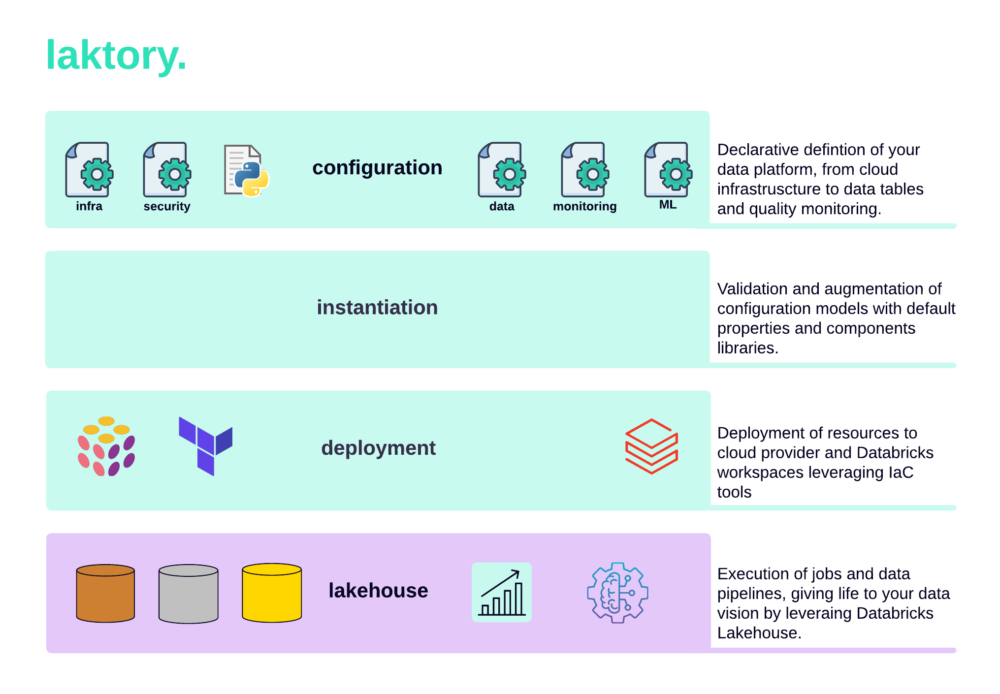

A DataOps framework for building Databricks lakehouse.



## What is it?
Laktory, the lakehouse factory, makes it possible to express and bring to life your data vision, from raw data to enriched analytics-ready datasets and finely tuned AI models, while adhering to basic DevOps best practices such as source control, code reviews and CI/CD.

### Declare
Declarative definition of your data platform, from cloud infrastructure to data tables, security and quality monitoring.
```yaml
name: slv_stock_prices
timestamp_key: created_at
builder:
  layer: SILVER
  table_source:
    name: brz_stock_prices
columns:
  - name: symbol
    type: string
    spark_func_name: coalesce
    spark_func_args:
      - data.symbol
  ...
```

### Validate
Validation and augmentation of configuration models with laktory default properties, templates and custom spark functions.
```py
from laktory import models

with open("table.yaml") as fp:
    table = models.Table.model_validate(fp)
```

### Deploy
Deployment of relevant resources to cloud provider and Databricks workspaces, using Laktory CLI and leveraging Infrastructure-as-Code (IaC) tools.

```commandline title="command line"
laktory deploy --filepath stack.yaml
```

### Operate
Execute, monitor and debug jobs and pipelines, giving life to your data vision, all from Databricks workspaces. 

Laktory is your best friend your best friend when it comes to prototyping and debugging data pipelines. 
Import the laktory-specific `dlt` package and execute and test your notebook outside of a Delta Live Table execution.

```py
from laktory import dlt
from laktory import read_metadata

# Read model
pl = read_metadata(pipeline="pl-stock-prices")
table = pl.tables[0]


# Build table
@dlt.table(name=table.name)
def get_df(table=table):
    # Read Source
    df = table.builder.read_source(spark)

    # Process
    df = table.builder.process(df, udfs=None, spark=spark)

    # Return
    return df


# Debug table
wrapper = get_df
df = dlt.get_df(wrapper)
display(df)
```

A data pipeline built with Laktory is shipped with custom hooks enabling fine-grained monitoring of performance and failures [under development]. 


## Who is it for?
Laktory is built by data engineers for data engineers. 
It does not have visual interface nor allow you to setup pipelines with a few clicks and some drag and drop.
On the other hand, if you have minimal DevOps or programming experience, you will be able to efficiently scale, deploying hundreds of datasets and models without compromising data governance.
It also provides you with the tools for building a UI within your organization for a fully self-served experience.

