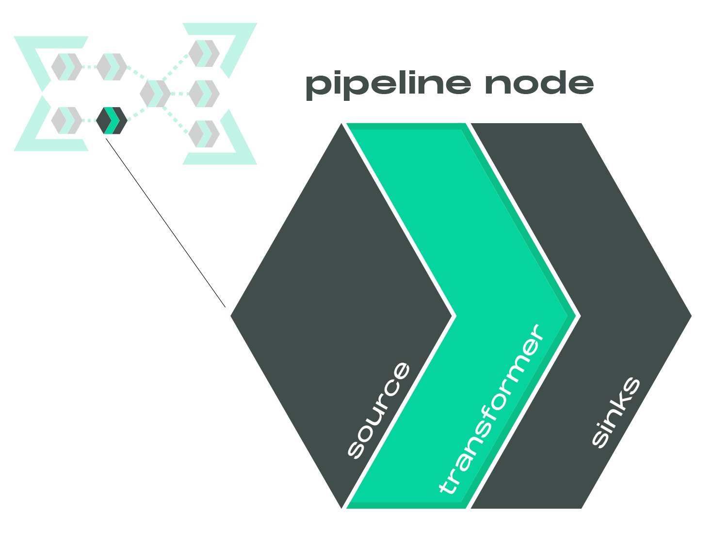

An open-source, dataframe-centric ETL framework for building lakehouses with a
DataOps approach.

## What is it?
Laktory, the lakehouse factory, is an open-source framework designed for 
building, deploying, and executing data pipelines while adhering to essential
DevOps best practices such as source control, code reviews, and CI/CD. 
Leveraging Apache Spark and Polars as its core data transformation engines, 
Laktory ensures robust and scalable data processing capabilities.


While a Laktory data pipeline can be run locally for small datasets or 
prototyping, it really starts to shine when deployed and orchestrated on a 
cloud data platform, such as Databricks. When combined with [Delta Live Tables](https://www.databricks.com/product/delta-live-tables),
it provides a top-tier, simple and low maintenance fully managed solution.  

Beyond just data pipelines, Laktory allows for the comprehensive definition
and deployment of your entire data platform. This includes everything from 
cloud infrastructure to data tables, security, and quality monitoring systems,
providing an all-in-one solution for modern data platform management.

## Data Pipeline
At its core, Laktory provides a pipeline model defined as a collection of
interconnected nodes.


Each node generate a dataframe by reading a source, applying transformations 
through a transformer, and optionally writing the output to a sink.




The transformations are defined through a chain of Spark (or Polars) function
calls, offering a highly scalable, flexible, and customizable framework,
particularly well-suited for streaming operations.

The entire pipeline definition is serializable, making it an ideal candidate
for a DataOps approach using infrastructure as code.

More details available [here](concepts/models/pipeline.md).

## DataOps
Laktory is designed from the ground up to adhere to DataOps best practices.


### Declare
Declarative definition of your data transformations using dataframe operators.
```yaml title="pipeline_node.yaml"
name: slv_stock_prices
source:
  path: ./events/stock_prices/
sink:
  schema_name: finance
  table_name: slv_stock_prices
layer: SILVER
transformer:
  nodes:
  - func_name: select
    func_args:
      - timestamp
      - symbol
      - open
      - close
      - high
      - low
      - volume
  - func_name: drop_duplicates
    func_kwargs:
      subset:
        - symbol
        - timestamp
...
```

### Validate
Validation and augmentation of configuration models with laktory default
properties, templates and custom Spark functions.
```py
from laktory import models

with open("pipeline_node.yaml") as fp:
    node = models.PipelineNode.model_validate(fp)
```

### Deploy
Deployment of relevant resources to a cloud provider and Databricks workspaces,
using Laktory CLI and leveraging Infrastructure-as-Code (IaC) tools.

```commandline title="command line"
laktory deploy --filepath stack.yaml
```

### Operate
Execution of data pipelines on local or remote host and monitoring of errors
using python code
```py
from laktory import models

with open("pipeline.yaml") as fp:
    pl = models.Pipeline.model_validate(fp)

pl.execute(spark=spark)
```

or Laktory CLI.
```commandline title="command line"
laktory run -p pl-stock-prices --env dev
```

## Demo
Watch how Laktory brings your pipeline definition into usable data tables. 


## Who is it for?
Laktory is built by data engineers for data engineers. 
It does not have visual interface nor allow you to setup pipelines with a few clicks and some drag and drop.
On the other hand, if you have minimal DevOps or programming experience, you will be able to efficiently scale, deploying hundreds of datasets and models without compromising data governance.
It also provides you with the tools for building a UI within your organization for a fully self-served experience.

## Okube


Laktory is one of the *kubes* developed by [Okube](https://www.okube.ai), a company dedicated to building open source frameworks, empowering businesses to build, deploy and operate highly scalable data platforms and AI models.

## Partners
Okube and Laktory are official Databricks Technology Partners


Learn more in our [Partners](partners.md) sections.