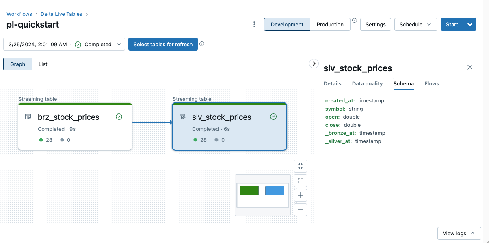
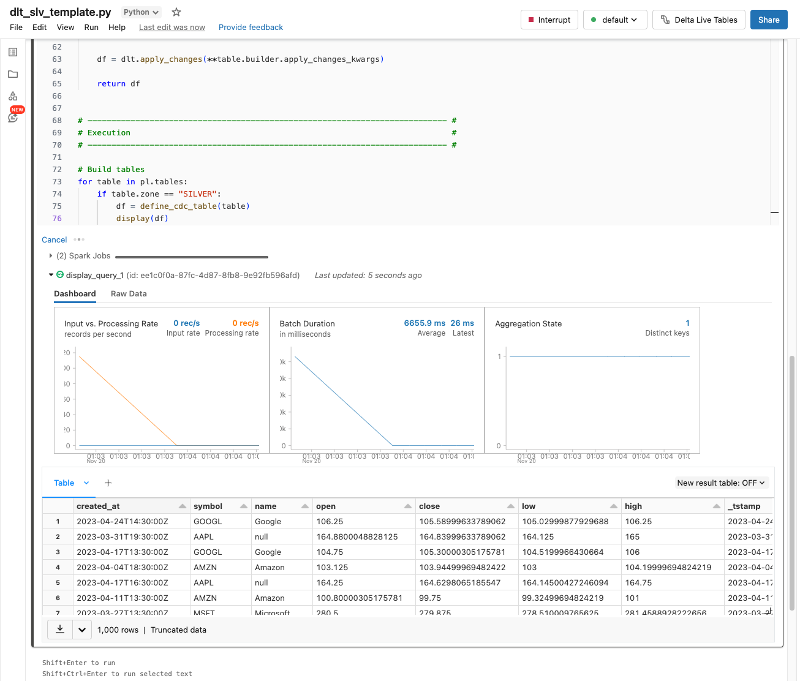

The easiest way to get started with Laktory is to use the CLI `quickstart` command 
to setup a pipeline that will process stock prices from big tech companies.

### Run CLI quickstart
Open a command prompt and invoke the `quickstart` command.
```cmd
laktory quickstart
```
You will be asked 2 questions:

- Infrastructure as Code backend (terraform or pulumi)
- Node type for compute (cloud specific, e.g. Standard_DS3_v2, c5.2xlarge, etc.)

Once completed, the stack files and resources have been created.

#### Stack File
??? "API Documentation"
    [`laktory.models.Stack`][laktory.models.Stack]<br>

The `stack.yaml` file is the main entry point defining the `name` of the stack, the selected `backend` and the list
of `resources` to be deployed. 

In this example, we define 3 resources:

- 1 data file (DBFSFile)
- 1 notebooks
- 1 pipeline

#### Notebook Files
The `notebooks/dlt/dlt_laktory_pl.py` file is the standard notebook used by Laktory pipelines using DLT orchestrator.

#### Data File
The `data/stock_prices.json` file is a data file storing stock prices. 
Normally, data would be mounted in Volumes from cloud storage, but for the simplicity a small data file is deployed as a
DBFS file. 

### Set Environment Variables

As you may have noticed by inspecting the `stack.yaml` file there are two expected environment variables:

- `DATABRICKS_HOST`: The workspace host URL 
- `DATABRICKS_TOKEN`: A valid workspace [token](https://docs.databricks.com/en/dev-tools/auth/pat.html)

Make sure they are properly set for a successful deployment.

### Run Deployment

You are now ready to deploy your stack to the workspace. If you are using terraform, you will need to first run an init
```cmd
laktory init
```

Then, simply deploy using
```cmd
laktory deploy --env dev
```

### Run your pipeline
Once deployed, you pipeline is ready to be run through Databricks UI


or using laktory CLI
```cmd
laktory run --dlt pl-quickstart
```

### Debug your pipeline
If you need to debug or modify one of your pipeline's notebook, Laktory makes it very easy by allowing you to run and inspect (with some limitations) the output data outside of the DLT pipeline.

```py title="dlt_laktory_pl.py"
from laktory import dlt
from laktory import models
from laktory import get_logger
from laktory import settings

dlt.spark = spark
logger = get_logger(__name__)

# Read pipeline definition
pl_name = spark.conf.get("pipeline_name", "pl-quickstart")
filepath = f"/Workspace{settings.workspace_laktory_root}pipelines/{pl_name}.json"
with open(filepath, "r") as fp:
    pl = models.Pipeline.model_validate_json(fp.read())

# --------------------------------------------------------------------------- #
# Tables and Views Definition                                                 #
# --------------------------------------------------------------------------- #


def define_table(node):
    @dlt.table_or_view(
        name=node.name,
        comment=node.description,
        as_view=node.sink is None,
    )
    @dlt.expect_all(node.warning_expectations)
    @dlt.expect_all_or_drop(node.drop_expectations)
    @dlt.expect_all_or_fail(node.fail_expectations)
    def get_df():
        logger.info(f"Building {node.name} node")

        # Execute node
        df = node.execute(spark=spark, udfs=udfs)
        df.printSchema()

        # Return
        return df

    return get_df


# --------------------------------------------------------------------------- #
# Execution                                                                   #
# --------------------------------------------------------------------------- #

# Build nodes
for node in pl.nodes:

    if node.dlt_template != "DEFAULT":
        continue

    wrapper = define_table(node)
    df = dlt.get_df(wrapper)
    display(df)
```

Output:




### Demo
Watch Laktory in action! 

