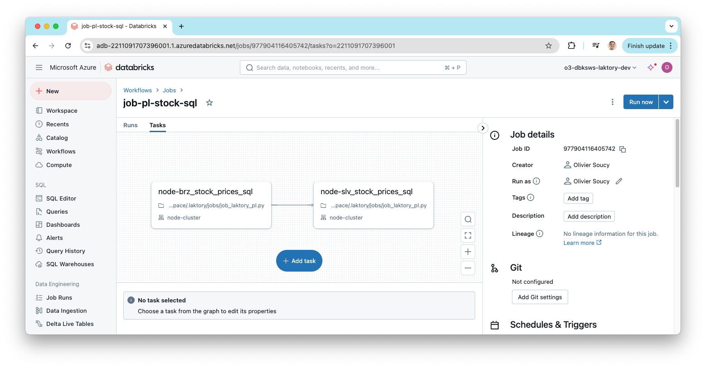
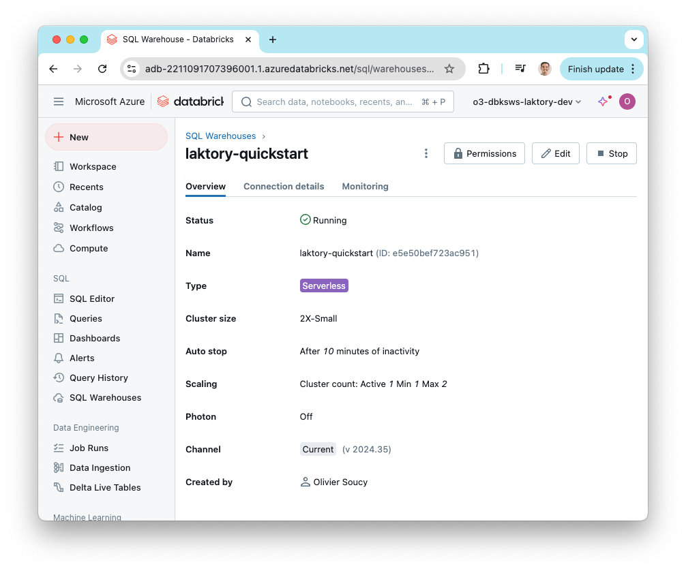
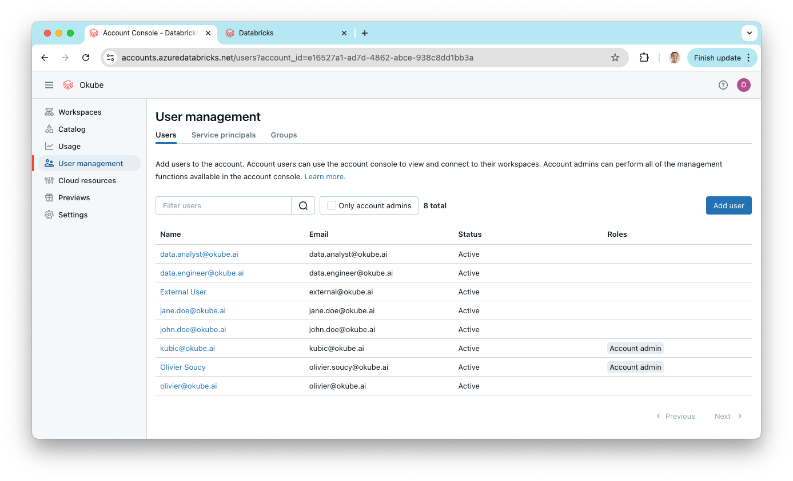
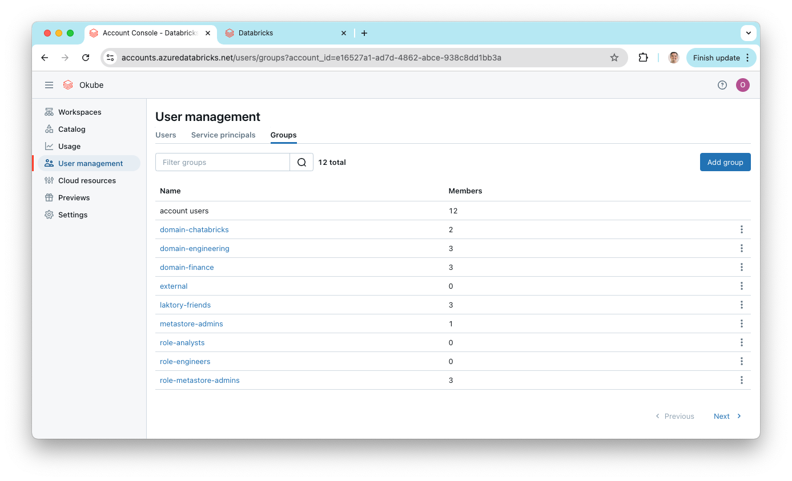
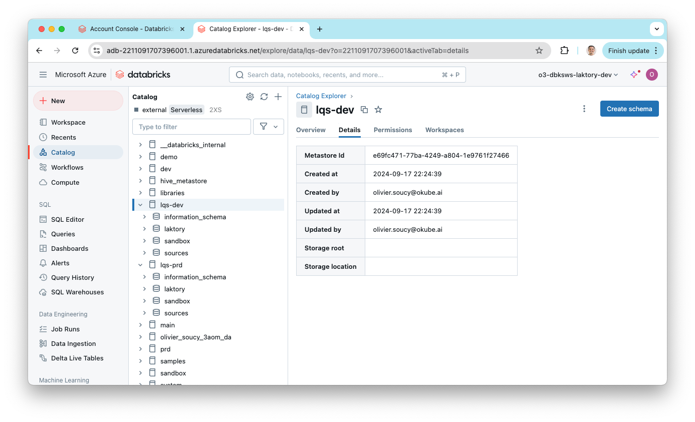

Getting started with Laktory is simple. Use the CLI quickstart command to set 
up a stack that aligns with the resources you want to deploy. You can choose 
from three templates, each tailored to specific deployment needs:

- `workflows`: A workspace-based deployment that includes notebooks, notebook jobs, Laktory job pipelines, and Laktory DLT pipelines.
- `workspace`: A deployment focused on your Databricks workspace, covering directories, secrets, and SQL warehouses.
- `unity-catalog`: A deployment targeting your Databricks account, including resources like groups, users, catalogs, and schemas.

After you followed the installation [instructions](install.md), open a command prompt and run the following command:
```cmd
laktory quickstart 
```
You will be prompted with two simple questions:

- Desired template: Choose between [workflows](#workspace-stack), [workspace](#workspace-stack) and [unity-catalog](#unity-catalog-stack)
- Infrastructure as Code backend: Select either `terraform` or `pulumi`

Once these are selected, Laktory will generate the `stack.yaml` [file](concepts/stack.md), file, which acts as the main
entry point for declaring all your resources. The associated resources will also be created. Other than the `stack.yaml`
file, you are free to organize folder structures and file names as you see fit—there’s no strict convention to follow.


## Workflows Stack
The `workflows` stack sets up and deploys three key components: a "Hello World!" Databricks job, a Laktory pipeline for
stock prices (as a Databricks Job and as a Delta Live Table), and all the necessary supporting resources.

### Create Stack
To create the stack, use the following command:
```commandline
laktory quickstart -t workflows
```

#### Files
After running the quickstart command, the following structure is created:

```bash
.
├── data
│   └── stock_prices.json
├── notebooks
│   ├── dlt
│   │   └── dlt_laktory_pl.py
│   └── jobs
│       ├── job_hello.py
│       └── job_laktory_pl.py
├── read_env.sh
├── requirements.txt
├── resources
│   ├── dbfsfiles.yaml
│   ├── job-hello.yaml
│   ├── notebooks.yaml
│   ├── pl-stocks-spark-dlt.yaml
│   └── pl-stocks-sql.yaml
├── sql
│   └── slv_stock_prices.sql
├── stack.yaml
```

#### Resources Directory
The files in the `resources` directory are referenced in the `stack.yaml` file and declare various resources to be 
deployed. Each file specifies one or more resources.

#### Notebooks Directory
The `notebooks` directory contains the notebooks to be deployed to the Databricks workspace, as defined in the 
`resources/notebooks.yaml` file. These notebooks are also referenced in job and pipeline definitions.

#### Data Directory
For the pipeline to run, a sample `stock_prices.json` data file is provided and will be uploaded to DBFS as declared in 
`resources/dbfsfiles.yaml`.

### Set Environment Variables
Before deployment, ensure the following environment variables are properly set, as referenced in the `stack.yaml` file:

- `DATABRICKS_HOST`: The URL of your Databricks workspace
- `DATABRICKS_TOKEN`: A valid Databricks [personal access token](https://docs.databricks.com/en/dev-tools/auth/pat.html)

### Deploy Stack
Now you are ready to deploy your stack. If you're using Terraform, start by initializing the environment:

```cmd
laktory init --env dev
```

Then, deploy the stack:
```cmd
laktory deploy --env dev
```

The deployment process will refresh the state of your Databricks resources and generate an execution plan using 
Terraform. Once the plan is generated, simply confirm by typing "yes" to proceed.

<div class="code-output">
```cmd
(laktory) osoucy@countach workflows % laktory deploy --env dev
databricks_dbfs_file.dbfs-file-stock-prices: Refreshing state... [id=/Workspace/.laktory/data/stock_prices/stock_prices.json]
databricks_notebook.notebook-job-laktory-pl: Refreshing state... [id=/.laktory/jobs/job_laktory_pl.py]
databricks_workspace_file.workspace-file-laktory-pipelines-pl-stocks-spark-dlt-json: Refreshing state... [id=/.laktory/pipelines/pl-stocks-spark-dlt.json]
databricks_workspace_file.workspace-file-laktory-pipelines-pl-stocks-sql-json: Refreshing state... [id=/.laktory/pipelines/pl-stocks-sql.json]
databricks_notebook.notebook-dlt-laktory-pl: Refreshing state... [id=/.laktory/dlt/dlt_laktory_pl.py]
databricks_notebook.notebook-job-hello: Refreshing state... [id=/.laktory/jobs/job_hello.py]
databricks_pipeline.pl-stocks-spark-dlt: Refreshing state... [id=dc28dbfb-0407-42fa-979f-94e17fa1fd30]
databricks_job.job-hello: Refreshing state... [id=808120666287598]
databricks_job.pipeline-databricks-job-job-pl-stock-sql: Refreshing state... [id=210130692451027]
databricks_permissions.permissions-job-hello: Refreshing state... [id=/jobs/808120666287598]
databricks_permissions.permissions-workspace-file-laktory-pipelines-pl-stocks-spark-dlt-json: Refreshing state... [id=/files/4435054900343469]
databricks_permissions.permissions-workspace-file-laktory-pipelines-pl-stocks-sql-json: Refreshing state... [id=/files/4435054900343468]

Note: Objects have changed outside of Terraform

Terraform used the selected providers to generate the following execution plan. Resource actions are indicated with the following symbols:
  + create
-/+ destroy and then create replacement

Terraform will perform the following actions:

  # databricks_dbfs_file.dbfs-file-stock-prices will be created
  + resource "databricks_dbfs_file" "dbfs-file-stock-prices" {
      + dbfs_path = (known after apply)
      + file_size = (known after apply)
      + id        = (known after apply)
      + md5       = "different"
      + path      = "/Workspace/.laktory/data/stock_prices/stock_prices.json"
      + source    = "./data/stock_prices.json"
    }
    [...]

Plan: 12 to add, 0 to change, 1 to destroy.

Do you want to perform these actions?
  Terraform will perform the actions described above.
  Only 'yes' will be accepted to approve.

  Enter a value: yes
```
</div>

<br>
After deployment, you can check the Databricks workspace to confirm that the pipeline job has been successfully deployed.



### Run Pipeline Job

You can now run your pipeline either from the Databricks UI or using the Laktory CLI:

```cmd
laktory run --env dev --job pl-stock-sql
```
This will start the pipeline run and provide real-time status updates for each task in the job. The output will show the
job's progress, including any tasks that are pending, running, or completed.

<div class="code-output">
```cmd
(laktory) osoucy@countach workflows % laktory run --env dev --job job-pl-stock-sql
INFO - Getting id for job job-pl-stock-sql
INFO - Getting id for pipeline pl-stocks-spark-dlt
INFO - Getting id for job job-hello
INFO - Job job-pl-stock-sql run started...
INFO - Job job-pl-stock-sql run URL: https://adb-2211091707396001.1.azuredatabricks.net/?o=2211091707396001#job/977904116405742/run/1052232433102036
INFO - Job job-pl-stock-sql state: RUNNING
INFO -    Task job-pl-stock-sql.node-brz_stock_prices_sql state: PENDING
INFO -    Task job-pl-stock-sql.node-slv_stock_prices_sql state: BLOCKED
INFO -    Task job-pl-stock-sql.node-brz_stock_prices_sql state: RUNNING
INFO -    Task job-pl-stock-sql.node-brz_stock_prices_sql state: TERMINATED
INFO -    Task job-pl-stock-sql.node-slv_stock_prices_sql state: PENDING
INFO -    Task job-pl-stock-sql.node-slv_stock_prices_sql state: RUNNING
INFO -    Task job-pl-stock-sql.node-slv_stock_prices_sql state: TERMINATING
INFO - Job job-pl-stock-sql state: TERMINATED
INFO -    Task job-pl-stock-sql.node-slv_stock_prices_sql state: TERMINATED
INFO - Job job-pl-stock-sql run terminated after 232.99 sec with RunLifeCycleState.TERMINATED 
INFO - Task job-pl-stock-sql.node-brz_stock_prices_sql terminated with RunResultState.SUCCESS 
INFO - Task job-pl-stock-sql.node-slv_stock_prices_sql terminated with RunResultState.SUCCESS 
```
</div>


## Workspace Stack
The `workspace` stack declares and deploys some directories, a few secrets
and a SQL Warehouse.

### Create Stack
To create the workspace stack, run the following command:
```commandline
laktory quickstart -t workspace
```

#### Files
After running the command, the following structure will be generated:
```bash
.
├── read_env.sh
├── requirements.txt
├── resources
│   ├── directories.yaml
│   ├── secretscopes.yaml
│   └── warehouses.yaml
├── stack.yaml
```

#### Resources Directory
The files in the `resources` directory are referenced in the `stack.yaml` file and declare various resources to be 
deployed. Each file specifies one or more resources.

### Set Environment Variables
Before deployment, ensure the following environment variables are properly set, as referenced in the `stack.yaml` file:

- `DATABRICKS_HOST`: The URL of your Databricks workspace
- `DATABRICKS_TOKEN`: A valid Databricks [personal access token](https://docs.databricks.com/en/dev-tools/auth/pat.html)

### Deploy Stack
Once the environment variables are set, you’re ready to deploy the stack. If you're using Terraform, initialize your 
environment first:

```cmd
laktory init --env dev
```

Then deploy the stack with:
```cmd
laktory deploy --env dev
```

During the deployment, Laktory will refresh the state of your Databricks resources and generate an execution plan. 
You'll see a list of the resources to be created, updated, or destroyed. Confirm the execution by typing "yes" when prompted.

<div class="code-output">
```cmd
(laktory) osoucy@countach workspace % laktory deploy --env dev
databricks_directory.directory-laktory-dashboards: Refreshing state... [id=/.laktory/dashboards/]
databricks_directory.directory-laktory-dlt: Refreshing state... [id=/.laktory/dlt/]
databricks_directory.directory-laktory-jobs: Refreshing state... [id=/.laktory/jobs/]
databricks_secret_scope.secret-scope-laktory: Refreshing state... [id=laktory]
databricks_directory.directory-laktory-pipelines: Refreshing state... [id=/.laktory/pipelines/]
databricks_directory.directory-laktory-queries: Refreshing state... [id=/.laktory/queries/]
databricks_sql_endpoint.warehouse-laktory: Refreshing state... [id=d376fdc94855474e]
databricks_secret_acl.secret-scope-acl-laktory-users: Refreshing state... [id=laktory|||users]
databricks_secret.secret-scope-laktory-env: Refreshing state... [id=laktory|||env]
databricks_permissions.permissions-warehouse-laktory: Refreshing state... [id=/sql/warehouses/d376fdc94855474e]

Terraform used the selected providers to generate the following execution plan. Resource actions are indicated with the following symbols:
  + create
-/+ destroy and then create replacement

Terraform will perform the following actions:

  # databricks_directory.directory-laktory-dashboards will be created
  + resource "databricks_directory" "directory-laktory-dashboards" {
      + delete_recursive = false
      + id               = (known after apply)
      + object_id        = (known after apply)
      + path             = "/.laktory/dashboards/"
      + workspace_path   = (known after apply)
    }

    [...]

Plan: 7 to add, 0 to change, 1 to destroy.

Do you want to perform these actions?
  Terraform will perform the actions described above.
  Only 'yes' will be accepted to approve.

  Enter a value: yes

databricks_permissions.permissions-warehouse-laktory: Destroying... [id=/sql/warehouses/d376fdc94855474e]
databricks_directory.directory-laktory-dashboards: Creating...
databricks_secret_scope.secret-scope-laktory: Creating...
databricks_directory.directory-laktory-queries: Creating...
databricks_permissions.permissions-warehouse-laktory: Destruction complete after 0s
databricks_directory.directory-laktory-dashboards: Creation complete after 1s [id=/.laktory/dashboards/]
databricks_sql_endpoint.warehouse-laktory: Creating...
databricks_directory.directory-laktory-queries: Creation complete after 1s [id=/.laktory/queries/]
databricks_secret_scope.secret-scope-laktory: Creation complete after 1s [id=laktory]
databricks_secret.secret-scope-laktory-env: Creating...
databricks_secret_acl.secret-scope-acl-laktory-users: Creating...
databricks_secret_acl.secret-scope-acl-laktory-users: Creation complete after 0s [id=laktory|||users]
databricks_secret.secret-scope-laktory-env: Creation complete after 0s [id=laktory|||env]
databricks_sql_endpoint.warehouse-laktory: Creation complete after 8s [id=e5e50bef723ac951]
databricks_permissions.permissions-warehouse-laktory: Creating...
databricks_permissions.permissions-warehouse-laktory: Creation complete after 2s [id=/sql/warehouses/e5e50bef723ac951]

Apply complete! Resources: 7 added, 0 changed, 1 destroyed.
```
</div>

<br>
Once the deployment completes, you can verify that the SQL warehouse and other 
resources have been successfully created by checking the Databricks workspace.


## Unity Catalog Stack
The `unity-catalog` stack deploys users, user groups, Unity Catalogs, catalogs, and schemas. This stack is more complex 
than the previous ones, as it targets both the Databricks account (for user management) and the workspace (for catalog creation).

### Create Stack
To create the Unity Catalog stack, run:
```commandline
laktory quickstart -t unit-catalog
```

#### Files
After running the command, the following structure will be generated:
```bash
.
├── read_env.sh
├── resources
│   ├── catalogs.yaml
│   ├── groups.yaml
│   ├── schemas.yaml
│   └── users.yaml
├── stack.yaml
```

#### Resources Directory
The files in the `resources` directory are referenced in the `stack.yaml` file and declare various resources to be 
deployed. Each file specifies one or more resources.

#### Stack Providers
In the `stack.yaml`, you will find the definition for two providers: `databricks` (for the account) and `databricks.dev`
(for the workspace). These may be formatted slightly differently if you’re using Pulumi.
```yaml
providers:
    
  databricks:
    host: https://accounts.azuredatabricks.net
    account_id: ${vars.DATABRICKS_ACCOUNT_ID}
    azure_tenant_id: ${vars.AZURE_TENANT_ID}
    azure_client_id: ${vars.AZURE_CLIENT_ID}
    azure_client_secret: ${vars.AZURE_CLIENT_SECRET}
    auth_type: azure-client-secret
    
  databricks.dev:
    alias: dev
    host: ${vars.DATABRICKS_HOST_DEV}
    token: ${vars.DATABRICKS_TOKEN_DEV}
```

The `databricks` provider deploys resources to your Databricks account, while
`databricks.dev` handles deployments to the workspace. Although Unity Catalog
resources are shared across workspaces, catalogs, schemas, and tables must
still be deployed to a specific workspace, which is why the workspace provider 
is needed.

In your resource definitions, the workspace provider is referenced like this:
```yaml
options:
  provider: ${resources.databricks.dev}
```

### Set Environment Variables
In this setup, more environment variables are required to deploy resources to both the Databricks account and workspace.

For the workspace provider:

- `DATABRICKS_HOST_DEV`: The URL of your Databricks development workspace
- `DATABRICKS_TOKEN_DEV`: A valid workspace [token](https://docs.databricks.com/en/dev-tools/auth/pat.html)

For the account provider:

- `DATABRICKS_ACCOUNT_ID`: The Databricks account ID
- `AZURE_TENANT_ID`: You Azure tenant ID
- `AZURE_CLIENT_ID`: The ID of the Azure Service Principal, which must be added as a Databricks account administrator
- `AZURE_CLIENT_SECRET`: The client secret of the Azure Service Principal

This setup is specific to Azure, but other authentication methods are available [here](https://docs.databricks.com/en/dev-tools/auth/oauth-m2m.html)


### Deploy Stack
Once your environment variables are set, you are ready to deploy the stack. If you're using Terraform, first run the 
initialization command:

```cmd
laktory init --env dev
```

Then, deploy the stack:
```cmd
laktory deploy --env dev
```

Terraform will generate an execution plan, and you'll see the resources that will be created. Confirm the actions by 
typing "yes" when prompted.

<div class="code-output">
```cmd
(laktory) osoucy@countach unity-catalog % laktory deploy

Terraform used the selected providers to generate the following execution plan. Resource actions are indicated with the following symbols:
  + create

Terraform will perform the following actions:

  # databricks_catalog.catalog-lqs-dev will be created
  + resource "databricks_catalog" "catalog-lqs-dev" {
      + enable_predictive_optimization = (known after apply)
      + force_destroy                  = true
      + id                             = (known after apply)
      + isolation_mode                 = "OPEN"
      + metastore_id                   = (known after apply)
      + name                           = "lqs-dev"
      + owner                          = (known after apply)
    }

  [...]

  # databricks_user_role.user-role-account_admin-user-kubic-okube-ai will be created
  + resource "databricks_user_role" "user-role-account_admin-user-kubic-okube-ai" {
      + id      = (known after apply)
      + role    = "account_admin"
      + user_id = (known after apply)
    }

Plan: 29 to add, 0 to change, 0 to destroy.

Do you want to perform these actions?
  Terraform will perform the actions described above.
  Only 'yes' will be accepted to approve.

  Enter a value: yes

databricks_catalog.catalog-lqs-prd: Creating...
databricks_catalog.catalog-lqs-dev: Creating...
databricks_group.group-metastore-admins: Creating...
databricks_group.group-workspace-admins: Creating...
databricks_user.user-jane-doe-okube-ai: Creating...
databricks_group.group-laktory-friends: Creating...
databricks_user.user-kubic-okube-ai: Creating...
databricks_user.user-john-doe-okube-ai: Creating...
databricks_group.group-laktory-friends: Creation complete after 1s [id=978906969228198]
[...]
databricks_grants.grants-schema-lqs-prd-sandbox: Creation complete after 1s [id=schema/lqs-prd.sandbox]
```
</div>

<br>
After the deployment is complete, you can check the Databricks account for the newly created users and groups.



In the workspace, you'll see the catalogs and schemas that were deployed.



## Demo

Watch Laktory Quickstart in action! 


