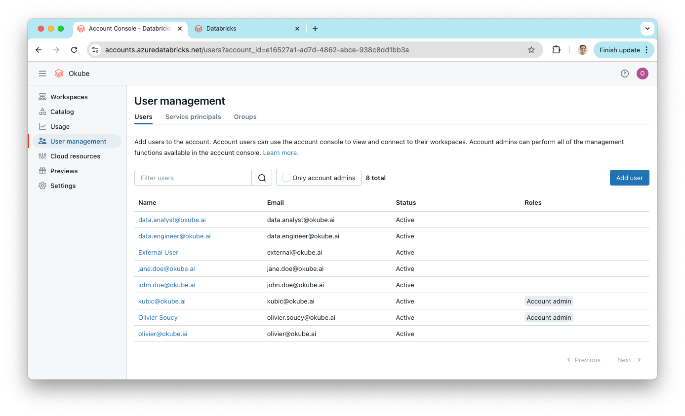
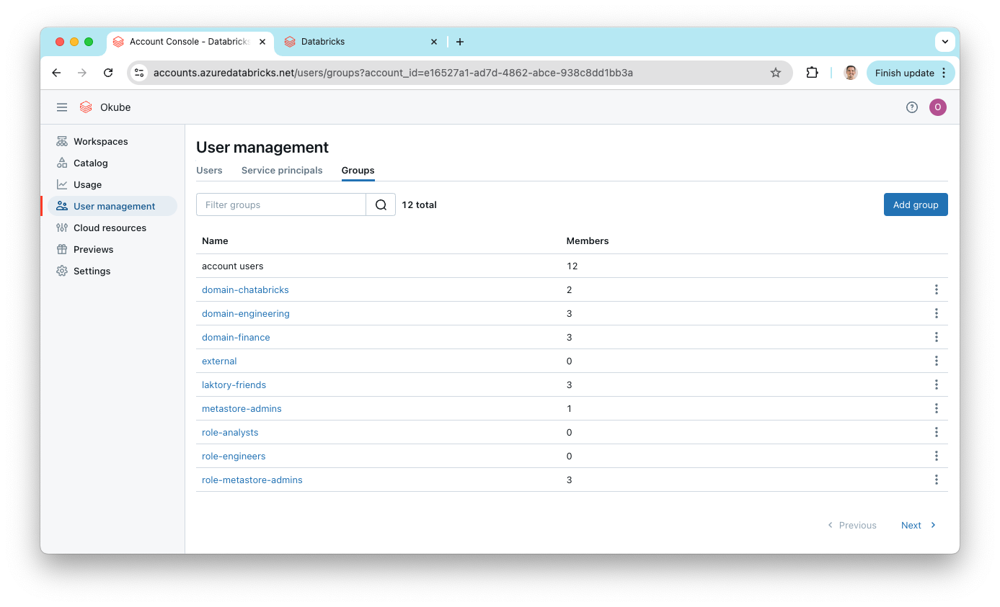
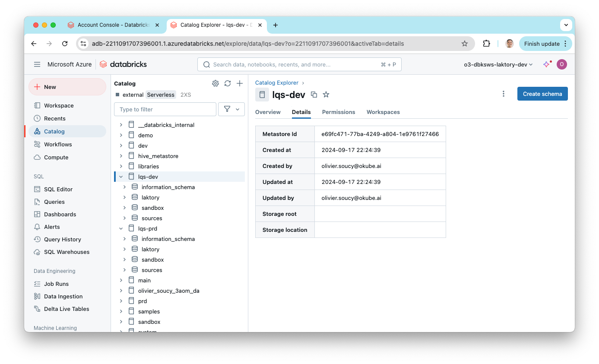

The `unity-catalog` stack deploys users, user groups, Unity Catalogs, catalogs, and schemas. This stack is more complex 
than the previous ones, as it targets both the Databricks account (for user management) and the (for catalog creation).

### Create Stack
To create the Unity Catalog stack, run:
```commandline
laktory quickstart -t unit-catalog
```


#### Files
After running the command, the following structure will be generated:
```bash
.
├── read_env.sh
├── resources
│   ├── catalogs.yaml
│   ├── groups.yaml
│   ├── schemas.yaml
│   └── users.yaml
├── stack.yaml
```

#### Resources Directory
The files in the `resources` directory are referenced in the `stack.yaml` file and declare various resources to be 
deployed. Each file specifies one or more resources.

#### Stack Providers
In the `stack.yaml`, you will find the definition for two providers: `databricks` (for the account) and `databricks.dev`
(for the workspace). These may be formatted slightly differently if you’re using Pulumi.
```yaml
providers:
    
  databricks:
    host: https://accounts.azuredatabricks.net
    account_id: ${vars.DATABRICKS_ACCOUNT_ID}
    azure_tenant_id: ${vars.AZURE_TENANT_ID}
    azure_client_id: ${vars.AZURE_CLIENT_ID}
    azure_client_secret: ${vars.AZURE_CLIENT_SECRET}
    auth_type: azure-client-secret
    
  databricks.dev:
    alias: dev
    host: ${vars.DATABRICKS_HOST_DEV}
    token: ${vars.DATABRICKS_TOKEN_DEV}
```

The `databricks` provider deploys resources to your Databricks account, while
`databricks.dev` handles deployments to the workspace. Although Unity Catalog
resources are shared across workspaces, catalogs, schemas, and tables must
still be deployed to a specific workspace, which is why the workspace provider 
is needed.

In your resource definitions, the workspace provider is referenced like this:
```yaml
options:
  provider: ${resources.databricks.dev}
```

### Set Environment Variables
In this setup, more environment variables are required to deploy resources to both the Databricks account and workspace.

For the workspace provider:

- `DATABRICKS_HOST_DEV`: The URL of your Databricks development workspace
- `DATABRICKS_TOKEN_DEV`: A valid workspace [token](https://docs.databricks.com/en/dev-tools/auth/pat.html)

For the account provider:

- `DATABRICKS_ACCOUNT_ID`: The Databricks account ID
- `AZURE_TENANT_ID`: You Azure tenant ID
- `AZURE_CLIENT_ID`: The ID of the Azure Service Principal, which must be added as a Databricks account administrator
- `AZURE_CLIENT_SECRET`: The client secret of the Azure Service Principal

This setup is specific to Azure, but other authentication methods are available [here](https://docs.databricks.com/en/dev-tools/auth/oauth-m2m.html)


### Deploy Stack
Once your environment variables are set, you are ready to deploy the stack. If you're using Terraform, first run the 
initialization command:

```cmd
laktory init --env dev
```

Then, deploy the stack:
```cmd
laktory deploy --env dev
```

Terraform will generate an execution plan, and you'll see the resources that will be created. Confirm the actions by 
typing "yes" when prompted.

<div class="code-output">
```cmd
(laktory) osoucy@countach unity-catalog % laktory deploy

Terraform used the selected providers to generate the following execution plan. Resource actions are indicated with the following symbols:
  + create

Terraform will perform the following actions:

  # databricks_catalog.catalog-lqs-dev will be created
  + resource "databricks_catalog" "catalog-lqs-dev" {
      + enable_predictive_optimization = (known after apply)
      + force_destroy                  = true
      + id                             = (known after apply)
      + isolation_mode                 = "OPEN"
      + metastore_id                   = (known after apply)
      + name                           = "lqs-dev"
      + owner                          = (known after apply)
    }

  [...]

  # databricks_user_role.user-role-account_admin-user-kubic-okube-ai will be created
  + resource "databricks_user_role" "user-role-account_admin-user-kubic-okube-ai" {
      + id      = (known after apply)
      + role    = "account_admin"
      + user_id = (known after apply)
    }

Plan: 29 to add, 0 to change, 0 to destroy.

Do you want to perform these actions?
  Terraform will perform the actions described above.
  Only 'yes' will be accepted to approve.

  Enter a value: yes

databricks_catalog.catalog-lqs-prd: Creating...
databricks_catalog.catalog-lqs-dev: Creating...
databricks_group.group-metastore-admins: Creating...
databricks_group.group-workspace-admins: Creating...
databricks_user.user-jane-doe-okube-ai: Creating...
databricks_group.group-laktory-friends: Creating...
databricks_user.user-kubic-okube-ai: Creating...
databricks_user.user-john-doe-okube-ai: Creating...
databricks_group.group-laktory-friends: Creation complete after 1s [id=978906969228198]
[...]
databricks_grants.grants-schema-lqs-prd-sandbox: Creation complete after 1s [id=schema/lqs-prd.sandbox]
```
</div>

<br>
After the deployment is complete, you can check the Databricks account for the newly created users and groups.



In the workspace, you'll see the catalogs and schemas that were deployed.


### Demo
As part of the **Lakhouse As Code** mini-series, watch how to set the foundation
for Unity Catalog using Laktory and the `unity-catalog` quickstart.


If you prefer, you can also read the [blog post](https://www.linkedin.com/pulse/lakehouse-code-01-unity-catalog-olivier-soucy-5oule/)
on the same topic.