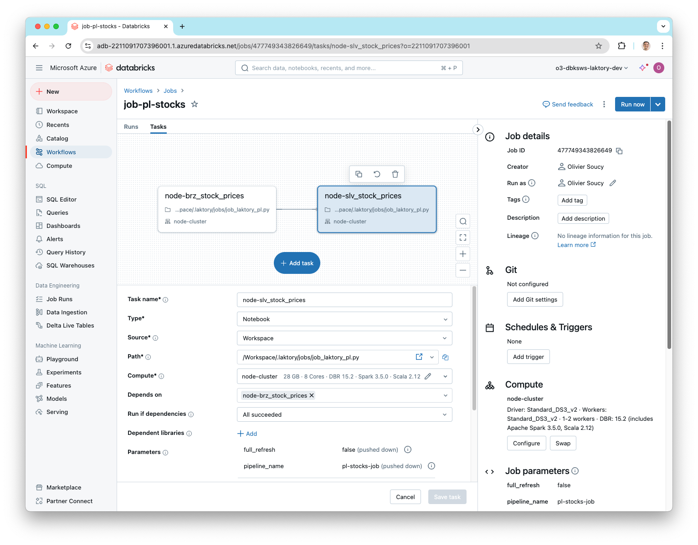
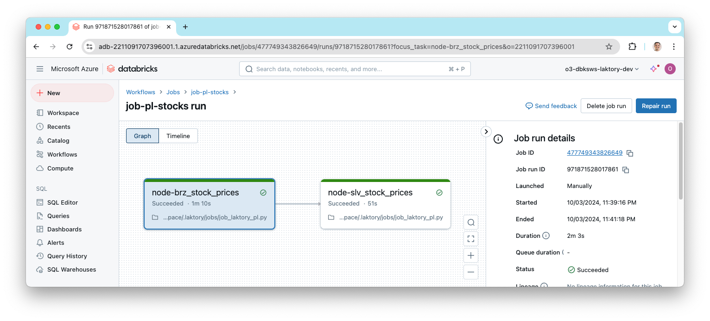
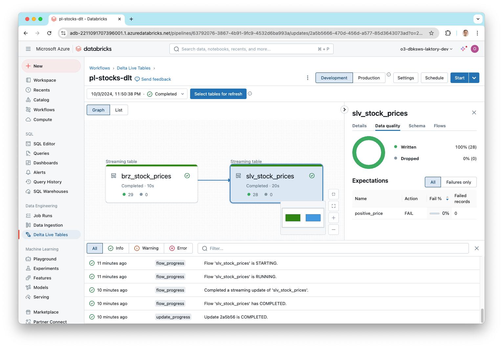

The `workflows` stack sets up and deploys three key components: a "Hello World!" Databricks job, a Laktory pipeline for
stock prices (as a Databricks Job and as a Delta Live Table), and all the necessary supporting resources.

### Create Stack
To create the stack, use the following command:
```commandline
laktory quickstart -t workflows
```

#### Files
After running the quickstart command, the following structure is created:

```bash
.
├── data
│   └── stock_prices.json
├── notebooks
│   ├── dlt
│   │   └── dlt_laktory_pl.py
│   └── jobs
│       ├── job_hello.py
│       └── job_laktory_pl.py
├── read_env.sh
├── requirements.txt
├── resources
│   ├── dbfsfiles.yaml
│   ├── job-hello.yaml
│   ├── notebooks.yaml
│   ├── pl-stocks-dlt.yaml
│   └── pl-stocks-job.yaml
├── scripts
│   ├── debug_pl.py
├── sql
│   └── slv_stock_prices.sql
├── stack.yaml
```

#### Resources Directory
The files in the `resources` directory are referenced in the `stack.yaml` file and declare various resources to be 
deployed. Each file specifies one or more resources.

#### Notebooks Directory
The `notebooks` directory contains the notebooks to be deployed to the Databricks workspace, as defined in the 
`resources/notebooks.yaml` file. These notebooks are also referenced in job and pipeline definitions.

#### Data Directory
For the pipeline to run, a sample `stock_prices.json` data file is provided and will be uploaded to DBFS as declared in 
`resources/dbfsfiles.yaml`.

#### Scripts Directory
The `debug_pl.py` script can be used to locally (from your IDE) develop, debug and execute the `pl-stocks-job` pipeline.

### Set Environment Variables
Before deployment, ensure the following environment variables are properly set, as referenced in the `stack.yaml` file:

- `DATABRICKS_HOST`: The URL of your Databricks workspace
- `DATABRICKS_TOKEN`: A valid Databricks [personal access token](https://docs.databricks.com/en/dev-tools/auth/pat.html)

### Deploy Stack
Now you are ready to deploy your stack. If you're using Terraform, start by initializing the environment:

```cmd
laktory init --env dev
```

Then, deploy the stack:
```cmd
laktory deploy --env dev
```

The deployment process will refresh the state of your Databricks resources and generate an execution plan using 
Terraform. Once the plan is generated, simply confirm by typing "yes" to proceed.

<div class="code-output">
```cmd
(laktory) osoucy@countach workflows % laktory deploy --env dev
databricks_dbfs_file.dbfs-file-stock-prices: Refreshing state... [id=/Workspace/.laktory/data/stock_prices/stock_prices.json]
databricks_notebook.notebook-job-laktory-pl: Refreshing state... [id=/.laktory/jobs/job_laktory_pl.py]
databricks_workspace_file.workspace-file-laktory-pipelines-pl-stocks-spark-dlt-json: Refreshing state... [id=/.laktory/pipelines/pl-stocks-spark-dlt.json]
databricks_workspace_file.workspace-file-laktory-pipelines-pl-stocks-sql-json: Refreshing state... [id=/.laktory/pipelines/pl-stocks-sql.json]
databricks_notebook.notebook-dlt-laktory-pl: Refreshing state... [id=/.laktory/dlt/dlt_laktory_pl.py]
databricks_notebook.notebook-job-hello: Refreshing state... [id=/.laktory/jobs/job_hello.py]
databricks_pipeline.pl-stocks-spark-dlt: Refreshing state... [id=dc28dbfb-0407-42fa-979f-94e17fa1fd30]
databricks_job.job-hello: Refreshing state... [id=808120666287598]
databricks_job.pipeline-databricks-job-job-pl-stock-sql: Refreshing state... [id=210130692451027]
databricks_permissions.permissions-job-hello: Refreshing state... [id=/jobs/808120666287598]
databricks_permissions.permissions-workspace-file-laktory-pipelines-pl-stocks-spark-dlt-json: Refreshing state... [id=/files/4435054900343469]
databricks_permissions.permissions-workspace-file-laktory-pipelines-pl-stocks-sql-json: Refreshing state... [id=/files/4435054900343468]

Note: Objects have changed outside of Terraform

Terraform used the selected providers to generate the following execution plan. Resource actions are indicated with the following symbols:
  + create
-/+ destroy and then create replacement

Terraform will perform the following actions:

  # databricks_dbfs_file.dbfs-file-stock-prices will be created
  + resource "databricks_dbfs_file" "dbfs-file-stock-prices" {
      + dbfs_path = (known after apply)
      + file_size = (known after apply)
      + id        = (known after apply)
      + md5       = "different"
      + path      = "/Workspace/.laktory/data/stock_prices/stock_prices.json"
      + source    = "./data/stock_prices.json"
    }
    [...]

Plan: 12 to add, 0 to change, 1 to destroy.

Do you want to perform these actions?
  Terraform will perform the actions described above.
  Only 'yes' will be accepted to approve.

  Enter a value: yes
```
</div>

<br>
After deployment, you can check the Databricks workspace to confirm that the pipeline job has been successfully deployed.



When a Laktory pipeline is deployed as a job, you don't have to manually create
each task, they are automatically created based on the nodes defined in your
pipeline.

### Develop Pipeline Job

With Laktory, you have the ability to prototype, test and debug your pipeline
directly from your IDE. Open the `scripts/debug_pl.py` script, add your cluster
ID and execute the script. A remote Spark session will be passed up execution
and you will be able to preview and explore the resulting DataFrames.

<div class="code-output">
```cmd
runfile('debug_pl.py', wdir='./')
resource_name_='pl-stocks-job' options=ResourceOptions(variables={}, depends_on=[], provider=None, ignore_changes=None, aliases=None, delete_before_replace=True, import_=None, parent=None, replace_on_changes=None) lookup_existing=None variables={} databricks_job=PipelineDatabricksJob(resource_name_=None, options=ResourceOptions(variables={}, depends_on=[], provider=None, ignore_changes=None, aliases=None, delete_before_replace=True, import_=None, parent=None, replace_on_changes=None), lookup_existing=None, variables={}, access_controls=[], clusters=[], continuous=None, control_run_state=None, email_notifications=None, format=None, health=None, max_concurrent_runs=None, max_retries=None, min_retry_interval_millis=None, name='job-pl-stock-sql', notification_settings=None, parameters=[JobParameter(variables={}, default='pl-stocks-sql', name='pipeline_name'), JobParameter(variables={}, default='false', name='full_refresh')], retry_on_timeout=None, run_as=None, schedule=None, tags={}, tasks=[JobTask(variables={}, condition_task=None, depends_ons=[], description=None, email_notifications=None, existing_cluster_id=None, health=None, job_cluster_key=None, libraries=None, max_retries=None, min_retry_interval_millis=None, notebook_task=JobTaskNotebookTask(variables={}, notebook_path='/.laktory/jobs/job_laktory_pl.py', base_parameters={'node_name': 'brz_stock_prices_sql'}, source=None), notification_settings=None, pipeline_task=None, retry_on_timeout=None, run_if=None, run_job_task=None, sql_task=None, task_key='node-brz_stock_prices_sql', timeout_seconds=None), JobTask(variables={}, condition_task=None, depends_ons=[JobTaskDependsOn(variables={}, task_key='node-brz_stock_prices_sql', outcome=None)], description=None, email_notifications=None, existing_cluster_id=None, health=None, job_cluster_key=None, libraries=None, max_retries=None, min_retry_interval_millis=None, notebook_task=JobTaskNotebookTask(variables={}, notebook_path='/.laktory/jobs/job_laktory_pl.py', base_parameters={'node_name': 'slv_stock_prices_sql'}, source=None), notification_settings=None, pipeline_task=None, retry_on_timeout=None, run_if=None, run_job_task=None, sql_task=None, task_key='node-slv_stock_prices_sql', timeout_seconds=None)], timeout_seconds=None, trigger=None, webhook_notifications=None, laktory_version=None, notebook_path=None) dataframe_type='SPARK' dlt=None name='pl-stocks-sql' nodes=[PipelineNode(variables={}, add_layer_columns=True, dlt_template='DEFAULT', dataframe_type='SPARK', description=None, drop_duplicates=None, drop_source_columns=None, transformer=None, expectations=[], layer=None, name='brz_stock_prices_sql', primary_key=None, sink=TableDataSink(variables={}, mode='OVERWRITE', write_options={}, catalog_name=None, checkpoint_location=None, format='DELTA', schema_name=None, table_name='brz_stock_prices_sql', warehouse='DATABRICKS'), source=FileDataSource(variables={}, as_stream=False, broadcast=False, cdc=None, dataframe_type='SPARK', drops=None, filter=None, limit=None, mock_df=None, renames=None, sample=None, selects=None, watermark=None, format='JSON', header=True, multiline=False, path='dbfs:/Workspace/.laktory/data/stock_prices/', read_options={}, schema_location=None), timestamp_key=None), PipelineNode(variables={}, add_layer_columns=True, dlt_template='DEFAULT', dataframe_type='SPARK', description=None, drop_duplicates=None, drop_source_columns=None, transformer=SparkChain(variables={}, dataframe_type='SPARK', nodes=[SparkChainNode(variables={}, dataframe_type='SPARK', func_args=[], func_kwargs={}, func_name=None, sql_expr='SELECT\n    cast(data.created_at AS TIMESTAMP) AS created_at,\n    data.symbol AS symbol,\n    data.open AS open,\n    data.close AS close\nFROM\n    {df}\n', with_column=None, with_columns=[]), SparkChainNode(variables={}, dataframe_type='SPARK', func_args=[], func_kwargs={'subset': ['created_at', 'symbol']}, func_name='drop_duplicates', sql_expr=None, with_column=None, with_columns=[])]), expectations=[], layer=None, name='slv_stock_prices_sql', primary_key=None, sink=TableDataSink(variables={}, mode='OVERWRITE', write_options={}, catalog_name=None, checkpoint_location=None, format='DELTA', schema_name=None, table_name='slv_stock_prices_sql', warehouse='DATABRICKS'), source=PipelineNodeDataSource(variables={}, as_stream=False, broadcast=False, cdc=None, dataframe_type='SPARK', drops=None, filter=None, limit=None, mock_df=None, renames=None, sample=None, selects=None, watermark=None, node_name='brz_stock_prices_sql', node=PipelineNode(variables={}, add_layer_columns=True, dlt_template='DEFAULT', dataframe_type='SPARK', description=None, drop_duplicates=None, drop_source_columns=None, transformer=None, expectations=[], layer=None, name='brz_stock_prices_sql', primary_key=None, sink=TableDataSink(variables={}, mode='OVERWRITE', write_options={}, catalog_name=None, checkpoint_location=None, format='DELTA', schema_name=None, table_name='brz_stock_prices_sql', warehouse='DATABRICKS'), source=FileDataSource(variables={}, as_stream=False, broadcast=False, cdc=None, dataframe_type='SPARK', drops=None, filter=None, limit=None, mock_df=None, renames=None, sample=None, selects=None, watermark=None, format='JSON', header=True, multiline=False, path='dbfs:/Workspace/.laktory/data/stock_prices/', read_options={}, schema_location=None), timestamp_key=None)), timestamp_key=None)] orchestrator='DATABRICKS_JOB' udfs=[] workspacefile=None
laktory.models.pipeline - INFO - Executing Pipeline
laktory.models.pipelinenode - INFO - Executing pipeline node brz_stock_prices (None)
laktory.models.datasources.filedatasource - INFO - Reading dbfs:/Workspace/.laktory/data/stock_prices/ as static
laktory.models.pipelinenode - INFO - Executing pipeline node slv_stock_prices (None)
laktory.models.datasources.pipelinenodedatasource - INFO - Reading pipeline node brz_stock_prices from output DataFrame
laktory.models.transformers.basechain - INFO - Executing SPARK chain
laktory.models.transformers.basechain - INFO - Executing SPARK chain node 0 (SparkChainNode).
laktory.models.transformers.sparkchainnode - INFO - DataFrame df as 
SELECT
    cast(data.created_at AS TIMESTAMP) AS created_at,
    data.symbol AS symbol,
    data.open AS open,
    data.close AS close
FROM
    {df}
laktory.models.transformers.basechain - INFO - Executing SPARK chain node 1 (SparkChainNode).
laktory.models.transformers.sparkchainnode - INFO - DataFrame df as drop_duplicates(subset=['created_at', 'symbol'])
+-------------------+------+------------------+------------------+
|created_at         |symbol|open              |close             |
+-------------------+------+------------------+------------------+
|2024-03-05 18:30:00|AAPL  |170.4600067138672 |170.04400634765625|
|2024-03-05 17:30:00|AMZN  |174.6999969482422 |173.8701934814453 |
|2024-03-05 16:30:00|AAPL  |170.4149932861328 |170.78500366210938|
|2024-03-05 15:30:00|AAPL  |169.9199981689453 |170.4199981689453 |
|2024-03-05 19:30:00|AMZN  |173.91000366210938|173.39500427246094|
|2024-03-05 14:30:00|MSFT  |413.0             |405.25            |
|2024-03-05 16:30:00|GOOGL |131.52999877929688|133.0850067138672 |
|2024-03-05 17:30:00|AAPL  |170.78500366210938|170.47000122070312|
|2024-03-05 18:30:00|GOOGL |132.7449951171875 |132.32000732421875|
|2024-03-05 19:30:00|GOOGL |132.3249969482422 |132.04010009765625|
+-------------------+------+------------------+------------------+
only showing top 10 rows
```
</div>

### Run Pipeline Job

You can now run your pipeline either from the Databricks UI or using the Laktory CLI:

```cmd
laktory run --env dev --job pl-stock-job
```
This will start the pipeline run and provide real-time status updates for each task in the job. The output will show the
job's progress, including any tasks that are pending, running, or completed.

<div class="code-output">
```cmd
(laktory) osoucy@countach workflows % laktory run --env dev --job job-pl-stocks
INFO - Getting id for job job-pl-stocks
INFO - Getting id for pipeline pl-stocks-dlt
INFO - Getting id for job job-hello
INFO - Job job-pl-stocks run started...
INFO - Job job-pl-stocks run URL: https://adb-2211091707396001.1.azuredatabricks.net/?o=2211091707396001#job/477749343826649/run/971871528017861
INFO - Job job-pl-stocks state: RUNNING
INFO -    Task job-pl-stocks.node-brz_stock_prices state: PENDING
INFO -    Task job-pl-stocks.node-slv_stock_prices state: BLOCKED
INFO -    Task job-pl-stocks.node-brz_stock_prices state: RUNNING
INFO -    Task job-pl-stocks.node-brz_stock_prices state: TERMINATED
INFO -    Task job-pl-stocks.node-slv_stock_prices state: PENDING
INFO -    Task job-pl-stocks.node-slv_stock_prices state: RUNNING
INFO - Job job-pl-stocks state: TERMINATED
INFO -    Task job-pl-stocks.node-slv_stock_prices state: TERMINATED
INFO - Job job-pl-stocks run terminated after  123.04 sec with RunLifeCycleState.TERMINATED ()
INFO - Task job-pl-stocks.node-brz_stock_prices terminated with RunResultState.SUCCESS ()
INFO - Task job-pl-stocks.node-slv_stock_prices terminated with RunResultState.SUCCESS ()

```
</div>
You can also lookup the resulting run from the workspace.



### Run Pipeline DLT

For the pipeline we deployed as a Delta Live Tables, we can also run it using
the CLI or simply from the UI.

