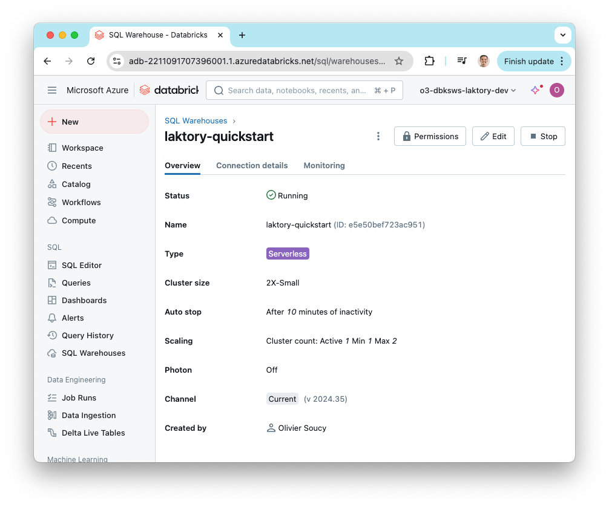

The `workspace` stack declares and deploys some directories, a few secrets
and a SQL Warehouse.

### Create Stack
To create the workspace stack, run the following command:
```commandline
laktory quickstart -t workspace
```

#### Files
After running the command, the following structure will be generated:
```bash
.
├── read_env.sh
├── requirements.txt
├── resources
│   ├── directories.yaml
│   ├── secretscopes.yaml
│   └── warehouses.yaml
├── stack.yaml
```

#### Resources Directory
The files in the `resources` directory are referenced in the `stack.yaml` file and declare various resources to be 
deployed. Each file specifies one or more resources.

### Set Environment Variables
Before deployment, ensure the following environment variables are properly set, as referenced in the `stack.yaml` file:

- `DATABRICKS_HOST`: The URL of your Databricks workspace
- `DATABRICKS_TOKEN`: A valid Databricks [personal access token](https://docs.databricks.com/en/dev-tools/auth/pat.html)

### Deploy Stack
Once the environment variables are set, you’re ready to deploy the stack. If you're using Terraform, initialize your 
environment first:

```cmd
laktory init --env dev
```

Then deploy the stack with:
```cmd
laktory deploy --env dev
```

During the deployment, Laktory will refresh the state of your Databricks resources and generate an execution plan. 
You'll see a list of the resources to be created, updated, or destroyed. Confirm the execution by typing "yes" when prompted.

<div class="code-output">
```cmd
(laktory) osoucy@countach workspace % laktory deploy --env dev
databricks_directory.directory-laktory-dashboards: Refreshing state... [id=/.laktory/dashboards/]
databricks_directory.directory-laktory-dlt: Refreshing state... [id=/.laktory/dlt/]
databricks_directory.directory-laktory-jobs: Refreshing state... [id=/.laktory/jobs/]
databricks_secret_scope.secret-scope-laktory: Refreshing state... [id=laktory]
databricks_directory.directory-laktory-pipelines: Refreshing state... [id=/.laktory/pipelines/]
databricks_directory.directory-laktory-queries: Refreshing state... [id=/.laktory/queries/]
databricks_sql_endpoint.warehouse-laktory: Refreshing state... [id=d376fdc94855474e]
databricks_secret_acl.secret-scope-acl-laktory-users: Refreshing state... [id=laktory|||users]
databricks_secret.secret-scope-laktory-env: Refreshing state... [id=laktory|||env]
databricks_permissions.permissions-warehouse-laktory: Refreshing state... [id=/sql/warehouses/d376fdc94855474e]

Terraform used the selected providers to generate the following execution plan. Resource actions are indicated with the following symbols:
  + create
-/+ destroy and then create replacement

Terraform will perform the following actions:

  # databricks_directory.directory-laktory-dashboards will be created
  + resource "databricks_directory" "directory-laktory-dashboards" {
      + delete_recursive = false
      + id               = (known after apply)
      + object_id        = (known after apply)
      + path             = "/.laktory/dashboards/"
      + workspace_path   = (known after apply)
    }

    [...]

Plan: 7 to add, 0 to change, 1 to destroy.

Do you want to perform these actions?
  Terraform will perform the actions described above.
  Only 'yes' will be accepted to approve.

  Enter a value: yes

databricks_permissions.permissions-warehouse-laktory: Destroying... [id=/sql/warehouses/d376fdc94855474e]
databricks_directory.directory-laktory-dashboards: Creating...
databricks_secret_scope.secret-scope-laktory: Creating...
databricks_directory.directory-laktory-queries: Creating...
databricks_permissions.permissions-warehouse-laktory: Destruction complete after 0s
databricks_directory.directory-laktory-dashboards: Creation complete after 1s [id=/.laktory/dashboards/]
databricks_sql_endpoint.warehouse-laktory: Creating...
databricks_directory.directory-laktory-queries: Creation complete after 1s [id=/.laktory/queries/]
databricks_secret_scope.secret-scope-laktory: Creation complete after 1s [id=laktory]
databricks_secret.secret-scope-laktory-env: Creating...
databricks_secret_acl.secret-scope-acl-laktory-users: Creating...
databricks_secret_acl.secret-scope-acl-laktory-users: Creation complete after 0s [id=laktory|||users]
databricks_secret.secret-scope-laktory-env: Creation complete after 0s [id=laktory|||env]
databricks_sql_endpoint.warehouse-laktory: Creation complete after 8s [id=e5e50bef723ac951]
databricks_permissions.permissions-warehouse-laktory: Creating...
databricks_permissions.permissions-warehouse-laktory: Creation complete after 2s [id=/sql/warehouses/e5e50bef723ac951]

Apply complete! Resources: 7 added, 0 changed, 1 destroyed.
```
</div>

<br>
Once the deployment completes, you can verify that the SQL warehouse and other 
resources have been successfully created by checking the Databricks workspace.


### Demo
As part of the **Lakhouse As Code** mini-series, watch how to configure a
workspace using Laktory and the `workspace` quickstart.


If you prefer, you can also read the [blog post](https://www.linkedin.com/pulse/lakehouse-code-02-workspace-olivier-soucy-gskme/)
on the same topic.

